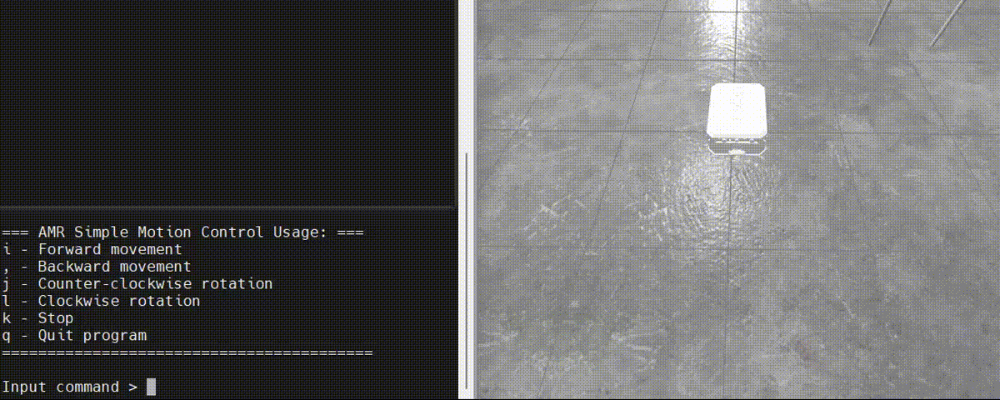
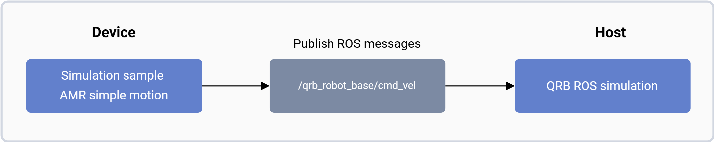

<div align="center">
  <h1>Simulation Sample AMR Simple Motion</h1>
  <p align="center">
    
  </p>
  <p>ROS Packages for simple movements control of QRB AMRs within a simulated environment</p>
  
  <a href="https://ubuntu.com/download/qualcomm-iot" target="_blank"></a>
  <a href="https://docs.ros.org/en/jazzy/" target="_blank"></a>
  
</div>

---

## 👋 Overview

The [Simulation Sample AMR Simple Motion](https://github.com/qualcomm-qrb-ros/qrb_ros_samples/tree/main/robotics/simulation_sample_amr_simple_motion) is a ROS package designed to control the simple movements of QRB Autonomous Mobile Robots(AMRs) within a simulated environment. 

<div align="center">
  
</div>

<br>

## 🔎 Table of contents
  * [APIs](#-apis)
     * [ROS interfaces](#ROS-interfaces)
  * [Supported targets](#-supported-targets)
  * [Installation](#-installation)
  * [Usage](#-usage)
     * [Prerequisites](#-prerequisites)
     * [Start the ROS2 node](#-start-the-ROS2-node-on-device)
  * [Build from source](#-build-from-source)
  * [Contributing](#-contributing)
  * [Contributors](#%EF%B8%8F-contributors)
  * [License](#-license)

## ⚓ APIs

### ROS interfaces

<table>
  <tr>
    <th>Interface</th>
    <th>Name</th>
    <th>Type</th>
    <td>Description</td>
  </tr>
  <tr>
    <td>Publisher</td>
    <td>/qrb_robot_base/cmd_vel</td>
    <td>geometry_msgs/msg/Twist</td>
    <td>AMR movement control message</td>
  </tr>
</table>

## 🎯 Supported targets

<table >
  <tr>
    <th>Development Hardware</th>
    <td>Qualcomm Dragonwing™ RB3 Gen2</td>
    <td>Qualcomm Dragonwing™ IQ-9075 EVK</td>
    <td>Qualcomm Dragonwing™ IQ-8275 EVK</td>
  </tr>
  <tr>
    <th>Hardware Overview</th>
    <th><a href="https://www.qualcomm.com/developer/hardware/rb3-gen-2-development-kit"></a></th>
    <th><a href="https://www.qualcomm.com/products/internet-of-things/industrial-processors/iq9-series/iq-9075"></a></th>
    <th>Coming soon...</th>
  </tr>
</table>

---

## ✨ Installation

> [!IMPORTANT]
> **PREREQUISITES**: The following steps need to be run on **Qualcomm Ubuntu** and **ROS Jazzy**.<br>
> Reference [Install Ubuntu on Qualcomm IoT Platforms](https://ubuntu.com/download/qualcomm-iot) and [Install ROS Jazzy](https://docs.ros.org/en/jazzy/index.html) to setup environment. <br>
> For Qualcomm Linux, please check out the [Qualcomm Intelligent Robotics Product SDK](https://docs.qualcomm.com/bundle/publicresource/topics/80-70018-265/introduction_1.html?vproduct=1601111740013072&version=1.4&facet=Qualcomm%20Intelligent%20Robotics%20Product%20(QIRP)%20SDK) documents.

Add Qualcomm IOT PPA for Ubuntu:

```bash
sudo add-apt-repository ppa:ubuntu-qcom-iot/qcom-ppa
sudo add-apt-repository ppa:ubuntu-qcom-iot/qirp
sudo apt update
```

Install Debian package:

```bash
sudo apt install ros-jazzy-simulation-sample-amr-simple-motion
```

## 🚀 Usage

### 🔹 Prerequisites

#### Simulation environment setup on host

Please refer to the `Quick Start` of [QRB ROS Simulation](https://github.com/qualcomm-qrb-ros/qrb_ros_simulation) to set up the simulation development environment and `build` the `QRB ROS Simulation` project on your host machine. Ensure that the device and the host are on the same local network and can communicate with each other via ROS2.

#### Launch the `QRB Robot Base AMR` on host

```bash
ros2 launch qrb_ros_sim_gazebo gazebo_robot_base.launch.py namespace:=qrb_robot_base enable_laser:=false
```

### 🔹 Start the ROS2 node on device

```bash
source /opt/ros/jazzy/setup.bash
ros2 run simulation_sample_amr_simple_motion simple_motion
```

The output for these commands:

```bash
=== AMR Simple Motion Control Usage: ===
i - Forward movement
, - Backward movement
j - Counter-clockwise rotation
l - Clockwise rotation
k - Stop
q - Quit program
=========================================

Input command >
```

---

## 👨‍💻 Build from source

Download the source code and build with `colcon`
```bash
source /opt/ros/jazzy/setup.bash
git clone https://github.com/qualcomm-qrb-ros/qrb_ros_samples.git
colcon build --packages-select simulation_sample_amr_simple_motion
```

Run and debug

```bash
source install/setup.bash
ros2 run simulation_sample_amr_simple_motion simple_motion
```

## 🤝 Contributing

We love community contributions! Get started by reading our [CONTRIBUTING.md](CONTRIBUTING.md).<br>
Feel free to create an issue for bug report, feature requests or any discussion💡.

## ❤️ Contributors

Thanks to all our contributors who have helped make this project better!

<table>
  <tr>
    <td align="center"><a href="https://github.com/quic-weijshen"><br /><sub><b>quic-weijshen</b></sub></a></td>
    <td align="center"><a href="https://github.com/fulaliu"><br /><sub><b>fulaliu</b></sub></a></td>
    <td align="center"><a href="https://github.com/jiaxshi"><br /><sub><b>jiaxshi</b></sub></a></td>
  </tr>
</table>

## 📜 License

Project is licensed under the [BSD-3-Clause](https://spdx.org/licenses/BSD-3-Clause.html) License. See [LICENSE](./LICENSE) for the full license text.