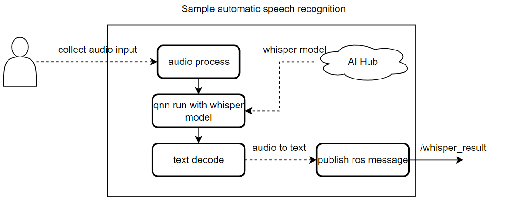

<div >
  <h1>AI Samples Speech Recogniztion	</h1>
  <p align="center">
</div>


---

## 👋 Overview

The ` speech recognition` sample enables a function that ASR case with qrb ros nodes.

It captures the audio input and publishes the result with the `/whisper_result`.

This figure contains the basic messages and data transfer channels, with the relevant client/server and ROS node.




Details workflow 


## 🔎 Table of contents

  * [Used ROS Topics](#-used-ros-topics)
  * [Supported targets](#-supported-targets)
  * [Installation](#-installation)
  * [Usage](#-usage)
  * [Build from source](#-build-from-source)
  * [Contributing](#-contributing)
  * [Contributors](#%EF%B8%8F-contributors)
  * [FAQs](#-faqs)
  * [License](#-license)

## ⚓ Used ROS Topics 

| ROS Topic         | Type          | Published By    |
| ----------------- | ------------- | --------------- |
| `/whisper_result` | `< String > ` | qrb ros whisper |

## 🎯 Supported targets

<table >
  <tr>
    <th>Development Hardware</th>
     <td>Qualcomm Dragonwing™ IQ-9075 EVK</td>
     <td>Qualcomm Dragonwing™ IQ-8275 EVK</td>
  </tr>
  <tr>
    <th>Hardware Overview</th>
    <th><a href="https://www.qualcomm.com/products/internet-of-things/industrial-processors/iq9-series/iq-9075"></a></th>
    <th>coming soon...</th>
  </tr>
  <tr>
    <th>GMSL Camera Support</th>
    <td>LI-VENUS-OX03F10-OAX40-GM2A-118H(YUV)</td>
    <td>LI-VENUS-OX03F10-OAX40-GM2A-118H(YUV)</td>
  </tr>
</table>


## ✨ Installation

> [!IMPORTANT]
> **PREREQUISITES**: The following steps need to be run on **Qualcomm Ubuntu** and **ROS Jazzy**.<br>
> Reference [Install Ubuntu on Qualcomm IoT Platforms](https://ubuntu.com/download/qualcomm-iot) and [Install ROS Jazzy](https://docs.ros.org/en/jazzy/index.html) to setup environment. <br>

## 👨‍💻 Build from source

<details>
  <summary>Build from source details</summary>

Prepare Model

```
sudo mkdir /opt/model
cd /opt/model
sudo wget https://raw.githubusercontent.com/openai/whisper/refs/heads/main/whisper/assets/mel_filters.npz
sudo wget https://raw.githubusercontent.com/openai/whisper/refs/heads/main/whisper/assets/gpt2.tiktoken
sudo wget https://huggingface.co/qualcomm/Whisper-Tiny-En/resolve/main/WhisperEncoder.tflite?download=true -O whisper_tiny_en-whisperencoder.tflite
sudo wget https://huggingface.co/qualcomm/Whisper-Tiny-En/resolve/main/WhisperDecoder.tflite?download=true -O WhisperDecoder.tflite
```

Install dependencies


```
sudo apt install ros-jazzy-rclpy \
  ros-jazzy-sensor-msgs \
  ros-jazzy-std-msgs \
  ros-jazzy-cv-bridge \
  ros-jazzy-ament-index-python \
  ros-jazzy-qrb-ros-tensor-list-msgs \
  python3-opencv \
  python3-numpy \
  libsamplerate0-dev \
  ros-jazzy-qrb-ros-nn-inference \
  python3-scipy \
  ffmpeg
  
pip3 install  audio2numpy samplerate torch tiktoken
```

Download the source code and build with colcon

```bash
source /opt/ros/jazzy/setup.bash
git clone https://github.com/qualcomm-qrb-ros/qrb_ros_samples.git
cd ai_audio/sample_speech_recognition
colcon build
```

Run the sample env on device

```
source /usr/share/qirp-setup.sh 

ros2 run sample_speech_recognition qrb_ros_whisper

#open an ssh terminal to start recording audio
while true; do [ ! -f "/home/qirp_ws/rec.wav.lock" ] && timeout 8 parec -v --rate=16000 --format=s16le --channels=1 --file-format=wav "/home/qirp_ws/rec.wav"; touch /home/qirp_ws/rec.wav.lock; sleep 1; done

#open an ssh terminal to get whisper node output
```


</details>

## 🤝 Contributing

We love community contributions! Get started by reading our [CONTRIBUTING.md](CONTRIBUTING.md).<br>
Feel free to create an issue for bug report, feature requests or any discussion💡.

## ❤️ Contributors

Thanks to all our contributors who have helped make this project better!

<table>
  <tr>
    <td align="center"><a href="https://github.com/quic-fulan"><br /><sub><b>quic-fulan</b></sub></a></td>
  </tr>
</table>


## ❔ FAQs

<details>
<summary>NA</summary><br>
</details>


## 📜 License

Project is licensed under the [BSD-3-Clause](https://spdx.org/licenses/BSD-3-Clause.html) License. See [LICENSE](./LICENSE) for the full license text.

