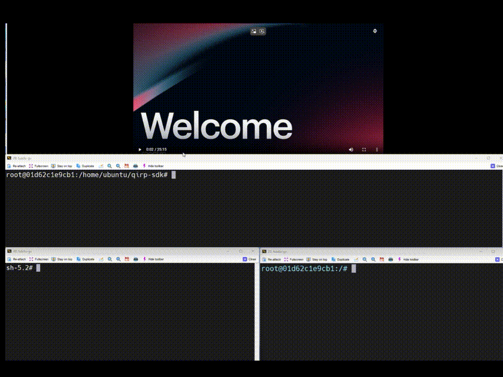

# AI Samples speech recognition

## Overview

The ` speech recognition` sample enables a function that ASR case with qrb ros nodes.

It captures the audio input and publishes the result with the `/whisper_result`.

This figure contains the basic messages and data transfer channels, with the relevant client/server and ROS node.




video link (https://qaihub-public-assets.s3.us-west-2.amazonaws.com/accelerating_on-device_development_and_deployment_with_qualcomm_ai_hub_siddhika_nevrekar.mp4)


## Pipeline flow for  speech recognition


Details workflow 

## Supported Platforms

| Hardware                   | Software               |
| -------------------------- | ---------------------- |
| Qualcomm RB3 gen2          | Canonical Ubuntu Image |
| IQ-9075 Evaluation Kit     | Canonical Ubuntu Image |
| IQ-8 Beta   Evaluation Kit | Canonical Ubuntu Image |


## ROS Topics Used in Speech recognition

| ROS Topic         | Type          | Published By     |
| ----------------- | ------------- | ---------------- |
| `/whisper_result` | `< String > ` | qrb ros whisperr |

## Use cases on Ubuntu

### Prerequisites

- `SSH` is enabled in ‘Permissive’ mode with the steps mentioned in [Log in using SSH](https://docs.qualcomm.com/bundle/publicresource/topics/80-70017-254/how_to.html?state=preview#use-ssh).

- Download and run QIRP SDK environment setup scripts  from :[qualcomm-linux/meta-qcom-robotics-sdk](https://github.com/qualcomm-linux/meta-qcom-robotics-sdk) 

  ```
  (ssh) wget https://raw.githubusercontent.com/qualcomm-linux/meta-qcom-robotics-sdk/refs/heads/kirkstone/recipes-sdk/files/qirp-setup.sh /home/qirp-setup.sh
  ```

### On device

 run the following commands in a terminal to set up QIRP SDK and ROS2 environment.

```
source /home/qirp-setup.sh 
export ADSP_LIBRARY_PATH=/lib/aarch64-oe-linux-gcc11.2:/lib/hexagon-v68/unsigned:${ADSP_LIBRARY_PATH};export PATH=/bin/aarch64-oe-linux-gcc11.2:$PATH;source /opt/ros/jazzy/setup.bash;source /home/ubuntu/qirp-sdk/install/setup.bash;ros2 run sample_speech_recognition qrb_ros_whisper

#open an ssh terminal to start recording audio
while true; do [ ! -f "/home/qirp_ws/rec.wav.lock" ] && timeout 8 parec -v --rate=16000 --format=s16le --channels=1 --file-format=wav "/home/qirp_ws/rec.wav"; touch /home/qirp_ws/rec.wav.lock; sleep 1; done

#open an ssh terminal to get whisper node output
```

## Use cases on QCLINUX

### Prerequisites

- `SSH` is enabled in ‘Permissive’ mode with the steps mentioned in [Log in using SSH](https://docs.qualcomm.com/bundle/publicresource/topics/80-70017-254/how_to.html?state=preview#use-ssh).

- Download and run QIRP SDK environment setup scripts  from [qualcomm-linux/meta-qcom-robotics-sdk](https://github.com/qualcomm-linux/meta-qcom-robotics-sdk) 

### On Host

Generate QIRP Docker, which includes ai samples

```
source setup.sh docker

#outputs can be found here:
runtime/qirp-docker.tar.gz
```

Push RP Docker to device

```
scp runtime/qirp-docker.tar.gz root@(ip):/opt
```

### On Device

Run QIRP SDK scripts to load docker images 

```
source /usr/share/qirp-setup.sh docker --docker-path /opt/qirp-docker.tar.gz

#run in docker 
root@xxxxx:/# export ADSP_LIBRARY_PATH=/lib/aarch64-oe-linux-gcc11.2:/lib/hexagon-v68/unsigned:${ADSP_LIBRARY_PATH};export PATH=/bin/aarch64-oe-linux-gcc11.2:$PATH;source /opt/ros/jazzy/setup.bash;source /home/ubuntu/qirp-sdk/install/setup.bash;ros2 run sample_speech_recognition qrb_ros_whisper
```

open an SSH terminal to start recording audio

```
while true; do [ ! -f "/opt/qirp_ws/rec.wav.lock" ] && timeout 8 parec -v --rate=16000 --format=s16le --channels=1 --file-format=wav "/opt/qirp_ws/rec.wav"; touch /opt/qirp_ws/rec.wav.lock; sleep 1; done
```

open an SSH terminal to get whisper node output

```
source  /usr/share/qirp-setup.sh docker

#run in docker 
root@xxxxx:/# source /opt/ros/jazzy/setup.sh
root@xxxxx:/# ros topic list
#ros topic outputs can be found here:
```

```
source /home/qirp-setup.sh 
export ADSP_LIBRARY_PATH=/lib/aarch64-oe-linux-gcc11.2:/lib/hexagon-v68/unsigned:${ADSP_LIBRARY_PATH};export PATH=/bin/aarch64-oe-linux-gcc11.2:$PATH;source /opt/ros/jazzy/setup.bash;source /home/ubuntu/qirp-sdk/install/setup.bash;ros2 run sample_speech_recognition qrb_ros_whisper

#open an ssh terminal to start recording audio
while true; do [ ! -f "/home/qirp_ws/rec.wav.lock" ] && timeout 8 parec -v --rate=16000 --format=s16le --channels=1 --file-format=wav "/home/qirp_ws/rec.wav"; touch /home/qirp_ws/rec.wav.lock; sleep 1; done

#open an ssh terminal to get whisper node output
```
