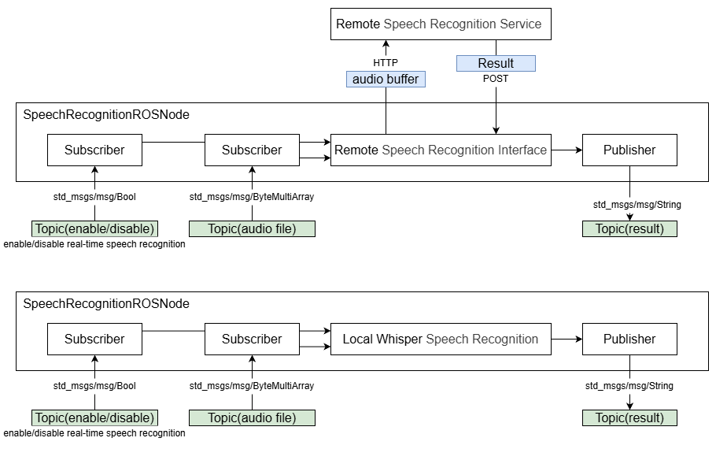

<div align="center">
  <h1>QRB ROS Speech Recognition ROS Node</h1>
  <p align="center">
   
      
  </p>
  <p>QRB ROS Speech Recognition ROS Node on Qualcomm Robotics Platforms</p>
  
  <a href="https://ubuntu.com/download/qualcomm-iot" target="_blank"></a>
  <a href="https://docs.ros.org/en/jazzy/" target="_blank"></a>
  
</div>

---

## 👋 Overview

The QRB ROS Speech Recognition Node is a real-time speech-to-text solution designed for Qualcomm Robotics platforms. It enables developers to integrate voice recognition capabilities into their robotic applications using ROS 2.

### Key Features

- Real-time sentence-level speech recognition using sound intensity detection.
- Supports voice input via USB microphone.
- Three operational modes:
  1. **Local Mode**: Uses AI-HUB's Whisper Tiny model locally.
  2. **Remote Mode**: Connects to a self-hosted remote service running a larger Whisper model.
  3. **Remote Audio Topic**: Supports recognition from remote audio topics.
- ROS 2 interfaces:
  - `/whisper_enable` (std_msgs/Bool): Enable/disable recognition.
  - `/whisper_text` (std_msgs/String): Output recognized text.
  - `/audio_file` (std_msgs/ByteMultiArray): Input remote audio data.

### Limitations

- USB microphone required.
- Local mode supports only Whisper Tiny English model.
- Remote service must be set up by the user (guidance provided).
- Mode selection via launch file configuration.
- Two launch files provided: one for USB mic, one for audio file input.

## Usercase for Speech Recognition ROS Node


## Pipeline flow for Speech Recognition ROS Node



## 🔎 Table of contents
  * [APIs](#-apis)
  * [Supported targets](#-supported-targets)
  * [Installation](#-installation)
  * [Build from source](#-Build-from-Source-and-Start-on-UBUNTU)
  * [remote service setup](#-remote-service-setup-guidance-example-whisper)
  * [Contributing](#-contributing)
  * [Contributors](#%EF%B8%8F-contributors)
  * [FAQs](#-faqs)
  * [License](#-license)

## ⚓ APIs

### 🔹 `Speech Recognition ROS Node` APIs

#### ROS interfaces

| Type       | Topic            | Message Type               | Description                      |
|------------|------------------|----------------------------|----------------------------------|
| Subscriber | `/whisper_enable`| `std_msgs/msg/Bool`        | Enable/disable recognition       |
| Publisher  | `/whisper_text`  | `std_msgs/msg/String`      | Recognized text output           |
| Subscriber | `/audio_file`    | `std_msgs/msg/ByteMultiArray` | Input remote audio data       |

## 🎯 Supported targets

<table >
  <tr>
    <th>Development Hardware</th>
    <td>Qualcomm Dragonwing™ RB3 Gen2</td>    
  </tr>
  <tr>
    <th>Hardware Overview</th>
    <th><a href="https://www.qualcomm.com/developer/hardware/rb3-gen-2-development-kit"></a></th>
  </tr>
  <tr>
    <th>System</th>
    <th>Canonical ubuntu</th>
  </tr>
</table>

---

## 👨‍💻 Build from Source and Start on UBUNTU

> **Note**: This guide reflects the latest build instructions. If discrepancies exist with online documentation, follow this guide.


#### Setup

1. Clone the repository

3. Install virtualenv
```bash
sudo apt-get update
sudo apt-get install -y python3.12-venv
python3 -m venv ~/venv_ros
source ~/venv_ros/bin/activate
```

34. Install dependencies
```bash
source ./test/install_packages_rb3gen2.sh
```

4. Prepare AI-HUB model (for local mode)
```bash
cd ./qrb_ros_samples/ai_audio/sample_speech_recognition_rt_rosnode
mkdir model
```

5. Download relate model files (only support for rb5gen2)
```bash
# Download MEL FILTER FILE to ./qrb_ros_samples/ai_audio/sample_speech_recognition_rt_rosnode/model.
wget https://qaihub-public-assets.s3.us-west-2.amazonaws.com/qai-hub-models/models/whisper_asr_shared/v1/openai_assets/mel_filters.npz
# Go to https://aihub.qualcomm.com download models
# Download ENCODING MODEL to ./qrb_ros_samples/ai_audio/sample_speech_recognition_rt_rosnode/model.
wget https://huggingface.co/qualcomm/Whisper-Tiny-En/resolve/a524bc29bc56e44818175809acf10af801e3b47a/WhisperEncoder.tflite?download=true -O whisper_tiny_en-whisperencoder.tflite
# Download DECODING MODEL to ./qrb_ros_samples/ai_audio/sample_speech_recognition_rt_rosnode/model.
wget https://huggingface.co/qualcomm/Whisper-Tiny-En/resolve/a524bc29bc56e44818175809acf10af801e3b47a/WhisperDecoder.tflite?download=true -O whisper_tiny_en-whisperdecoder.tflite
```

#### Build
```bash
source /opt/ros/jazzy/setup.bash
export PATH=/root/venv_ros/bin:$PATH
export PYTHONPATH=/root/venv_ros/lib/python3.12/site-packages:$PYTHONPATH
export WHISPER_MODEL_PATH="<path of your model>"
colcon build --cmake-clean-cache
```

#### Run Real-Time Speech Recognition (USB Mic)
- This example uses a USB MIC and continuously publishes the results of speech recognition.
1. Source this file to set up the environment on your device:
```bash
source install/local_setup.bash
```

2. Run the ROS2 package.
```bash
ros2 launch qrb_ros_speech_recognition qrb_ros_speech_recognition.launch.py
```

3. Run the test Node to print the speech recognition result.
```bash
python ./test/qrb_ros_print.py
```

4. Run the enable Node. Publish "true"/"false" to enable/disable Real-time speech recognition. 
```bash
python ./test/test_asr_switch.py
```

- Modify `qrb_ros_speech_recognition.launch.py` to configure:
```python
{
  'AudioEnergyThreshold': 0.5,  # Threshold for audio energy
  'ShortTermWindow': 0.1,       # Time window (in seconds) for sampling audio energy
  'MovingAverageWindow': 30,    # Number of samples for moving average window
  'AvailableWindow': 1,         # Minimum valid audio length (in seconds)
  'LocalTiny': 0                # 1: run local tiny_en model; 0: use remote service
}
```

#### Run Audio File Speech Recognition
- This example used remote speech recognition service.
  - Make sure follow the remote speech recognition service guidance to establish the remote service.
  - Make sure that an another ROS Node submit /audio_file topic.

1. Source this file to set up the environment on your device:
```bash
source install/local_setup.bash
```

2. Run the ROS2 package.
```bash
ros2 launch qrb_ros_speech_recognition qrb_ros_android_asr.launch.py
```

3. Run the test Node.
```bash
python ./test/qrb_ros_print.py
```

## Remote Service Setup guidance (example: whisper)

1. Prepare environment for `service_asr.py`.
  
2. Establish model in your service.
- Reference https://github.com/openai/whisper
- Example: ./test/service_asr.py:
```python
model = whisper.load_model("turbo", device="cuda")
```

3. Modify IP and Port. you should make sure ROS Node use the same IP and Port
- Example service_asr.py. "10.92.128.242" is the service's IP, you can modify your port "port=5000".
```python
app.run(host='10.92.128.242', port=5000)
```
- Example ROS Node qrb_ros_speech_recognition.py:
```python
server_url = 'http://10.92.128.242:5000/transcribe'
```

4. Modify launch file choice remote service.
- Example qrb_ros_speech_recognition.launch.py:
```python
{'LocalTiny': 0}      # 1：local tiny_en. 0:remote service.
```

5. Run `service_asr.py` remotely and ROS node locally.

## 🤝 Contributing

We love community contributions! Get started by reading our [CONTRIBUTING.md](CONTRIBUTING.md).  
Feel free to create an issue for bug reports, feature requests, or any discussion 💡.

## ❤️ Contributors

Thanks to all our contributors who have helped make this project better!

<table>
  <tr>
    <td align="center"><a href="https://github.com/quic-shouhu"><br /><sub><b>quic-shouhu</b></sub></a></td>
  </tr>
</table>

## ❔ FAQs

> 📌 Include common and popular questions and answers

## 📜 License

Project is licensed under the [BSD-3-Clause](https://spdx.org/licenses/BSD-3-Clause.html) License. See [LICENSE](./LICENSE) for the full license text.
