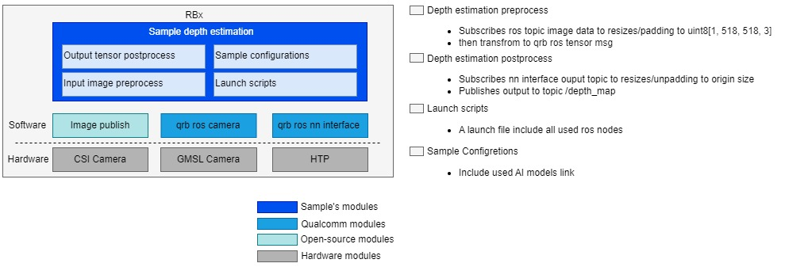

<div >
  <h1>AI Sample Depth Estimation</h1>
  <p align="center">
</div>


---

## 👋 Overview

- This sample allows you to input an RGB image named `input_image.jpg` or subscribe to the ROS topic `/cam0_stream1` from `qrb ros camera`. It then uses QNN to perform model inference and publishes the result as the `/depth_map` ROS topic containing per-pixel depth values.
- The model is sourced from [Depth Anything V2](https://aihub.qualcomm.com/iot/models/depth_anything_v2?searchTerm=depth&domain=Computer+Vision) that a deep convolutional neural network model for depth estimation.



| Node Name                                                    | Function                                                     |
| ------------------------------------------------------------ | ------------------------------------------------------------ |
| [qrb ros camera](https://github.com/qualcomm-qrb-ros/qrb_ros_camera) | Qualcomm ROS 2 package that captures images with parameters and publishes them to ROS topics. |
| image publisher                                              | Publishes image data to a ROS topic—can be camera frames, local files, or processed outputs. |
| sample depth estimation    | The node subscribes to input images for preprocessing, then performs postprocessing on the output tensor published by the qrb ros nn interface node. |
| [qrb ros nn interface](https://github.com/qualcomm-qrb-ros/qrb_ros_nn_inference) | Loads a trained AI model, receives preprocessed images, performs inference, and publishes results. |

## 🔎 Table of contents

  * [Used ROS Topics](#-used-ros-topics)
  * [Supported targets](#-supported-targets)
  * [Installation](#-installation)
  * [Usage](#-usage)
  * [Build from source](#-build-from-source)
  * [Contributing](#-contributing)
  * [Contributors](#%EF%B8%8F-contributors)
  * [FAQs](#-faqs)
  * [License](#-license)

## ⚓ Used ROS Topics 

| ROS Topic                       | Type                                          | Description                    |
| ------------------------------- | --------------------------------------------- | ------------------------------ |
| `/image_raw `                   | `<sensor_msgs.msg.Image> `                   | public image info              |
| `/qrb_inference_input_tensor `  | `<qrb_ros_tensor_list_msgs.msg.TensorList> ` | preprocess message             |
| `/qrb_inference_output_tensor ` | `<qrb_ros_tensor_list_msgs.msg.TensorList> ` | nn interface result with model |
| `/depth_map ` | `<sensor_msgs.msg.Image> ` | depth map result              |

## 🎯 Supported targets

<table>
  <tr>
    <th>Development Hardware</th>
    <th>Hardware Overview</th>
  </tr>
  <tr>
    <td>Qualcomm Dragonwing™ IQ-9075 EVK</td>
    <td>
      <a href="https://www.qualcomm.com/products/internet-of-things/industrial-processors/iq9-series/iq-9075">
        
      </a>
    </td>
  </tr>
  <tr>
    <td>GMSL Camera Support</td>
    <td>LI-VENUS-OX03F10-OAX40-GM2A-118H(YUV)</td>
  </tr>
</table>

## ✨ Installation

> [!IMPORTANT]

> **PREREQUISITES**: For Qualcomm Linux, please check out the [Qualcomm Intelligent Robotics Product SDK](https://docs.qualcomm.com/bundle/publicresource/topics/80-70020-265/quick_start.html?vproduct=1601111740013072&version=1.5&facet=Qualcomm%20Intelligent%20Robotics%20SDK#setup-demo-qs) documents.

## 🚀 Usage

<details>
  <summary>Usage details</summary>

```bash
source /usr/share/qirp-setup.sh
ros2 launch sample_depth_estimation launch_with_image_publisher.py
or # You can also replace this with a custom image file or model path
ros2 launch sample_depth_estimation launch_with_image_publisher.py image_path:=<your local image path> model_path:=<your local model path>
or # You can launch with qrb ros camera
ros2 launch sample_depth_estimation launch_with_qrb_ros_camera.py
```

When using this launch script, it will use the default parameters:

```py
    image_path_arg = DeclareLaunchArgument(
        'image_path',
        default_value=os.path.join(package_path, "resource", "input_image.jpg"),
        description='Path to the input image file'
    )

    # Node for image_publisher
    image_publisher_node = Node(
        package='image_publisher',  
        executable='image_publisher_node', 
        namespace=namespace,
        name='image_publisher_node', 
        output='screen', 
        parameters=[
            {'filename': image_path},  
            {'rate': 10.0},  # Set the publishing rate to 10 Hz
        ]
    )
```

It will send local input_image.jpg file with a publishing rate of `10` Hz. 

Then you can check ROS topics with the topic name `/depth_map` in rviz.

</details>

## 👨‍💻 Build from source

Coming soon ...

## 🤝 Contributing

We love community contributions! Get started by reading our [CONTRIBUTING.md](CONTRIBUTING.md).<br>
Feel free to create an issue for bug report, feature requests or any discussion💡.

## ❤️ Contributors

Thanks to all our contributors who have helped make this project better!

<table>
  <tr>
    <td style="text-align: center;">
      <a href="https://github.com/DotaIsMind">
        
        <br />
        <sub><b>teng</b></sub>
      </a>
    </td>
  </tr>
</table>


## ❔ FAQs

<details>
<summary>How to get origin output of the QNN inference node?</summary><br>
Comment the following code in depth_estimation_node.py to get the origin output of the QNN inference node.

```python
# Normalize to [0,255]
normalized = cv2.normalize(output_image, None, 0, 255, cv2.NORM_MINMAX)
colored = cv2.applyColorMap(normalized.astype(np.uint8), cv2.COLORMAP_INFERNO)
```
</details>


## 📜 License

Project is licensed under the [BSD-3-Clause](https://spdx.org/licenses/BSD-3-Clause.html) License. See [LICENSE](../../LICENSE) for the full license text.