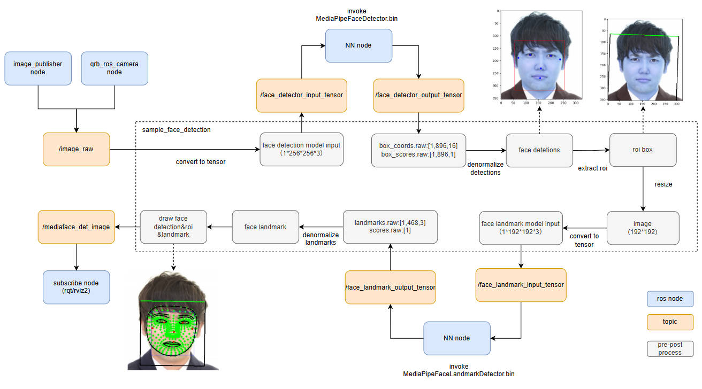

# AI Sample Face Detection


## 👋 Overview

The ` sample_face_detection` is a Python-based face detection ROS node that uses QNN for model inference.
The models are sourced from Qualcomm AI-hub.It can detect face and locate facial features from face image
It captures the `face_image.jpg` as input and publishes the result to the `/mediaface_det_image` topic.

For model information, please refer to [MediaPipe-Face-Detection - Qualcomm AI Hub](https://aihub.qualcomm.com/iot/models/mediapipe_face?searchTerm=Media)

## Pipeline Flow For Face Detection



| ROS Node         | Description                                                  |
| ---------------- | ------------------------------------------------------------ |
| qrb_ros_face_detector | qrb_ros_face_detector is a Python-based ros jazzy packages that processes face images. This ROS node subscribes to an image topic, and publishes face image result topic after pre/post processing. ` |
| [qrb_ros_nn_inference](https://github.com/qualcomm-qrb-ros/qrb_ros_nn_inference) | qrb_ros_nn_inference is a ROS2 package for performing neural network model, providing AI-based perception for robotics applications. |
| [qrb ros camera](https://github.com/qualcomm-qrb-ros/qrb_ros_camera) | Qualcomm ROS 2 package that captures images with parameters and publishes them to ROS topics. |
| [image_publisher_node](https://github.com/ros-perception/image_pipeline) | image_publisher is  a ros jazzy packages, can publish image ros topic with local path. |


## 🔎 Table of contents

  * [Used ROS Topics](#-used-ros-topics)
  * [Supported targets](#-supported-targets)
  * [Usage](#-usage)
  * [Build from source](#-build-from-source)
  * [Contributing](#-contributing)
  * [Contributors](#%EF%B8%8F-contributors)
  * [FAQs](#-faqs)
  * [License](#-license)

## ⚓ Used ROS Topics 

| ROS Topic | Type                         | Published By     |
| --------- | ---------------------------- | ---------------- |
| `/mediaface_det_image`  | `< sensor_msgs.msg.Image > ` | `qrb_ros_face_detector` |
| `/image_raw`                   | `<sensor_msgs.msg.Image> `  | `image_publisher_node, camera_node` |
| `/face_detector_input_tensor ` | `<qrb_ros_tensor_list_msgs.msg.TensorList> ` | `qrb_ros_face_detector`     |
| `/face_detector_output_tensor ` | `<qrb_ros_tensor_list_msgs.msg.TensorList> ` | `qrb_ros_nn_inference`     |
| `/face_landmark_input_tensor ` | `<qrb_ros_tensor_list_msgs.msg.TensorList> ` | `qrb_ros_face_detector`     |
| `/face_landmark_output_tensor ` | `<qrb_ros_tensor_list_msgs.msg.TensorList> ` | `qrb_ros_nn_inference`     |

## 🎯 Supported targets

<table >
  <tr>
    <th>Development Hardware</th>
     <td>Qualcomm Dragonwing™ IQ-9075 EVK</td>
  </tr>
  <tr>
    <th>Hardware Overview</th>
    <th><a href="https://www.qualcomm.com/products/internet-of-things/industrial-processors/iq9-series/iq-9075"></a></th>
  </tr>
  <tr>
    <th>GMSL Camera Support</th>
    <td>LI-VENUS-OX03F10-OAX40-GM2A-118H(YUV)</td>
  </tr>
</table>

## 🚀 Usage

<details>
  <summary>Usage details</summary>

```bash
# Set up the runtime environment for QClinux platform.
export HOME=/opt
source /usr/share/qirp-setup.sh
export ROS_DOMAIN_ID=xx # Value range of ROS_DOMAIN_ID: [0, 232]

# You can use defalut face image file
ros2 launch sample_face_detection launch_with_image_publisher.py model_path:=/opt/model/
# You can also replace this with a custom image file
ros2 launch sample_face_detection launch_with_image_publisher.py image_path:=/opt/resource/xxx.jpg model_path:=/opt/model/
or # You can launch with qrb_ros_camera lacunch file
ros2 launch sample_face_detection launch_with_qrb_ros_camera.py  model_path:=/opt/model/
```

When using this launch script, it will use the default parameters:

```py
DeclareLaunchArgument(
'image_path',
default_value=os.path.join(package_path, 'face_image.jpg'),
description='Path to the image file'
)

# Node for image_publisher
image_publisher_node = Node(
package='image_publisher',  
executable='image_publisher_node', 
namespace=namespace,
name='image_publisher_node', 
output='screen', 
parameters=[
{'filename': image_path},  
{'rate': 10.0},  # Set the publishing rate to 10 Hz
]
)
```

It will send local glasses.jpg file, and outputs image at `10` Hz. 

The output for these commands:

```
[INFO] [launch]: All log files can be found below /opt/.ros/log/1970-01-07-14-29-55-414204-qcs9075-iq-9075-evk-3111720
[INFO] [launch]: Default logging verbosity is set to INFO
[INFO] [component_container-1]: process started with pid [3111750]
[INFO] [component_container-2]: process started with pid [3111751]
[INFO] [qrb_ros_face_detector-3]: process started with pid [3111752]
[component_container-1] [INFO] [0000570595.865649109] [my_container]: Load Library: /usr/lib/libcamera_node.so
[component_container-2] [INFO] [0000570595.868632025] [image_processing_container]: Load Library: /usr/lib/libqrb_ros_inference_node.so
[component_container-2] [INFO] [0000570595.872836765] [image_processing_container]: Found class: rclcpp_components::NodeFactoryTemplate<qrb_ros::nn_inference::QrbRosInferenceNode>
[component_container-2] [INFO] [0000570595.872910671] [image_processing_container]: Instantiate class: rclcpp_components::NodeFactoryTemplate<qrb_ros::nn_inference::QrbRosInferenceNode>
[component_container-2] [QRB INFO] Loading model from binary file: /opt/model/MediaPipeFaceDetector.bin
[component_container-1] [INFO] [0000570595.882365098] [my_container]: Found class: rclcpp_components::NodeFactoryTemplate<qrb_ros::camera::CameraNode>
[component_container-1] [INFO] [0000570595.882437442] [my_container]: Instantiate class: rclcpp_components::NodeFactoryTemplate<qrb_ros::camera::CameraNode>
[component_container-1] [INFO] [0000570595.889684525] [camera_node]: QRB Camera Node statrt
[component_container-1] [INFO] [0000570595.889941557] [camera_node]: load camera intrinsic param
[component_container-1] [INFO] [0000570595.895467807] [camera_node]: system time: 570593556709625 ros time: 570595895466192 time offset: 2338756567 ns
[component_container-1] [INFO] [0000570595.896553484] [camera_node]: QRB Camera Node init success
[component_container-1] [INFO] [QMMFCamera]: start camera.
[component_container-2]  <W> Initializing HtpProvider
[component_container-2] [QRB INFO] /usr/lib/libQnnHtp.so initialize successfully
[INFO] [launch_ros.actions.load_composable_nodes]: Loaded node '/camera_node' in container '/my_container'
[component_container-2] /prj/qct/webtech_scratch20/mlg_user_admin/qaisw_source_repo/rel/qairt-2.35.0/release/snpe_src/avante-tools/prebuilt/dsp/hexagon-sdk-5.4.0/ipc/fastrpc/rpcmem/src/rpcmem_android.
c:38:dummy call to rpcmem_init, rpcmem APIs will be used from libxdsprpc
[component_container-2] [QRB INFO] Qnn device initialize successfully
[component_container-2] [QRB INFO] Initialize Qnn graph from binary file successfully
[component_container-2] [INFO] [0000570596.007669109] [nn_inference_node_face_detector]: Inference init successfully!
[INFO] [launch_ros.actions.load_composable_nodes]: Loaded node '/nn_inference_node_face_detector' in container '/image_processing_container'
[component_container-2] [INFO] [0000570596.010963119] [image_processing_container]: Found class: rclcpp_components::NodeFactoryTemplate<qrb_ros::nn_inference::QrbRosInferenceNode>
[component_container-2] [INFO] [0000570596.011018327] [image_processing_container]: Instantiate class: rclcpp_components::NodeFactoryTemplate<qrb_ros::nn_inference::QrbRosInferenceNode>
[component_container-2] [QRB INFO] Loading model from binary file: /opt/model/MediaPipeFaceLandmarkDetector.bin
[component_container-2] [QRB INFO] /usr/lib/libQnnHtp.so initialize successfully
[component_container-2] [QRB INFO] Qnn device initialize successfully
[component_container-2] [QRB INFO] Initialize Qnn graph from binary file successfully
[INFO] [launch_ros.actions.load_composable_nodes]: Loaded node '/nn_inference_node_face_landmark' in container '/image_processing_container'
[component_container-2] [INFO] [0000570596.049267234] [nn_inference_node_face_landmark]: Inference init successfully!
[qrb_ros_face_detector-3] [INFO] [0000570596.132309786] [mediaface_det_node]: MODEL_PATH set to: /opt/model/
[qrb_ros_face_detector-3] [INFO] [0000570596.133496557] [mediaface_det_node]: init done~
[qrb_ros_face_detector-3] [INFO] [0000570596.401828900] [mediaface_det_node]: Received image on image_raw topic
[qrb_ros_face_detector-3] [INFO] [0000570596.409178744] [mediaface_det_node]: Processed for face detection, publishing TensorList
[component_container-2] [INFO] [0000570596.424597494] [nn_inference_node_face_detector]: Got model input data, start executing inference...
[component_container-2] [INFO] [0000570596.428739734] [nn_inference_node_face_detector]: Inference execute successfully!
[component_container-2] [INFO] [0000570596.428851244] [nn_inference_node_face_detector]: Publish the inference result...
[qrb_ros_face_detector-3] [INFO] [0000570596.429197390] [mediaface_det_node]: Already processing an image, skipping this one.
[qrb_ros_face_detector-3] [INFO] [0000570596.430287390] [mediaface_det_node]: Received TensorList on face_detector_output_tensor

```

Then you can check the /mediaface_det_image ROS topic in rviz.

</details>

## 👨‍💻 Build from source

<details>
  <summary>Build from source details</summary>

Download the source code and build with colcon

```bash
source /usr/share/qirp-setup.sh
git clone https://github.com/qualcomm-qrb-ros/qrb_ros_samples.git
cd ai_vision/sample_face_detection
colcon build
```

Run and debug

```bash
source install/setup.bash
# You can use defalut face image file
ros2 launch sample_face_detection launch_with_image_publisher.py model_path:=/opt/model/

# You can also replace this with a custom image file
ros2 launch sample_face_detection launch_with_image_publisher.py image_path:=/opt/resource/xxx.jpg model_path:=/opt/model/

# You can launch with qrb ros camera
ros2 launch sample_face_detection launch_with_qrb_ros_camera.py  model_path:=/opt/model/
```

</details>

## 🤝 Contributing

We love community contributions! Get started by reading our [CONTRIBUTING.md](CONTRIBUTING.md).

Feel free to create an issue for bug report, feature requests or any discussion💡.

## ❤️ Contributors

Thanks to all our contributors who have helped make this project better!

<table>
  <tr>
    <td align="center"><a href="https://github.com/chuhxie"><br /><sub><b>chuhxie</b></sub></a></td>
  </tr>
</table>


## ❔ FAQs

<details>
<summary>Can detect multiple face?</summary><br>
No,it can only support single face detection.
</details>


## 📜 License

Project is licensed under the [BSD-3-Clause](https://spdx.org/licenses/BSD-3-Clause.html) License. See [LICENSE](./LICENSE) for the full license text.
