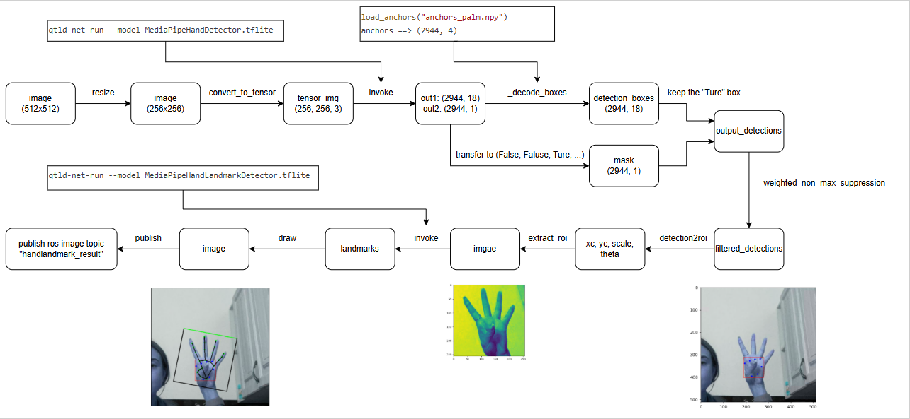

# AI Samples hand landmark detection

## Overview

`sample_hand_detection` is a Python-based hand recognition ROS node that uses QNN for model inference. 

The model is sourced from MediaPipe Hand Landmark Detector. The MediaPipe Hand Landmark Detector is a machine learning pipeline that predicts bounding boxes and pose skeletons of hands in an image.

This sample allows you to input an image named `input_image.jpg`, then it will publishes the result as ROS topic `handlandmark_result`

For more information, please refer to https://github.com/qualcomm-qrb-ros/qrb_ros_samples/tree/main/ai_vision/sample_hand_detection


## Pipeline flow for hand landmark detection



## Supported Platforms

| Hardware               | Software                                 |
| ---------------------- | ---------------------------------------- |
| IQ-9075 Evaluation Kit | Qualcomm Linux, Qualcomm Ubuntu |

## ROS Nodes Used in hand landmark detection

| ROS Node                | Description                                                  |
| ----------------------- | ------------------------------------------------------------ |
| `qrb_ros_hand_detector`    | qrb_ros_hand_detector is a python-based ros jazzy packages realize classify images. This ROS node subscribes image topic, and publishs classify result topic after pre-post process. |
| `qrb_ros_nn_inference` | qrb_ros_nn_inference is a ROS2 package for performing neural network model, providing AI-based perception for robotics applications. source link: [qualcomm-qrb-ros/qrb_ros_nn_inference](https://github.com/qualcomm-qrb-ros/qrb_ros_nn_inference) |
| `orbbec-camera` | orbbec-camera is  a ros jazzy packages,  enables the Orbbec Gemini camera 335L to work in RGB or depth mode and generates the RGB and depth information by ros topics. source link: [Qualcomm Linux/orbbec-camera](https://docs.qualcomm.com/bundle/publicresource/topics/80-70020-265/orbbec-camera_5_2_8.html) |
| `image_publisher_node` | image_publisher is  a ros jazzy packages, can publish image ros topic with local path. source link: [ros-perception/image_pipeline: An image processing pipeline for ROS.](https://github.com/ros-perception/image_pipeline) |

## ROS Topics Used in hand landmark detection

| ROS Topic                      | Type                         | Published By            |
| ------------------------------ | ---------------------------- | ----------------------- |
| `handlandmark_result ` | `<sensor_msgs.msg.Image> ` | `qrb_ros_hand_detector`     |
| `palm_detector_input_tensor ` | `<qrb_ros_tensor_list_msgs.msg.TensorList> ` | `qrb_ros_hand_detector`     |
| `palm_detector_output_tensor ` | `<qrb_ros_tensor_list_msgs.msg.TensorList> ` | `qrb_ros_nn_inference`     |
| `landmark_detector_input_tensor ` | `<qrb_ros_tensor_list_msgs.msg.TensorList> ` | `qrb_ros_hand_detector`     |
| `landmark_detector_output_tensor ` | `<qrb_ros_tensor_list_msgs.msg.TensorList> ` | `qrb_ros_nn_inference`     |
| `image_raw`                   | `<sensor_msgs.msg.Image> `  | `image_publisher_node, orbbec_camera_node` |


## Use cases on QCLINUX

### Prerequisites

- Please refer to [Settings](https://docs.qualcomm.com/bundle/publicresource/topics/80-70018-265/download-the-prebuilt-robotics-image_3_1.html?vproduct=1601111740013072&version=1.4&facet=Qualcomm%20Intelligent%20Robotics%20Product%20(QIRP)%20SDK) to complete the device and host setup.

### On Host

**Step 1: Build sample project**

On the host machine, move to the artifacts directory and decompress the package using the `tar` command.

```bash
# set up qirp sdk environment
tar -zxf qirp-sdk_<qirp_version>.tar.gz
cd <qirp_decompressed_path>/qirp-sdk
source setup.sh

# build sample
cd <qirp_decompressed_path>/qirp-sdk/qirp-samples/ai_vision/sample_hand_detection
colcon build
```

**Step 2: Package and push sample to device**

```bash
# package and push hand detection models
cd <qirp_decompressed_path>/qirp-sdk/qirp-samples/ai_vision/sample_hand_detection
tar -czvf model_hand_detection.tar.gz model resource/input_image.jpg
scp model_hand_detection.tar.gz root@[ip-addr]:/opt/

# package and push build result of sample
cd <qirp_decompressed_path>/qirp-sdk/qirp-samples/ai_vision/sample_hand_detection/install/sample_hand_detection
tar -czvf sample_hand_detection.tar.gz lib share
scp sample_hand_detection.tar.gz root@[ip-addr]:/opt/
```

### On Device

To Login to the device, please use the command `ssh root@[ip-addr]`

**Step 1: Install sample package and model package**

```bash
# Remount the /usr directory with read-write permissions
(ssh) mount -o remount rw /usr

# Install sample package and model package
(ssh) tar --no-same-owner -zxf /opt/sample_hand_detection.tar.gz -C /usr/
(ssh) tar --no-same-owner -zxf /opt/model_hand_detection.tar.gz -C /opt/
```

**Step 2: Setup runtime environment**

```bash
# setup runtime environment
(ssh) source /usr/share/qirp-setup.sh -m
```

**Step 3: Run sample**
```bash
# Launch the sample hand detection node with an image publisher, You can replace 'image_path' with the path to your desired image.
ros2 launch sample_hand_detection launch_with_image_publisher.py image_path:=/opt/resource/input_image.jpg model_path:=/opt/model/

# Launch the sample hand detection node with orbbec camera ros node.
ros2 launch sample_hand_detection launch_with_orbbec_camera.py model_path:=/opt/model/
```

Then, you can open `rviz2` on HOST and subscribe `handlandmark_result` to get the result.

