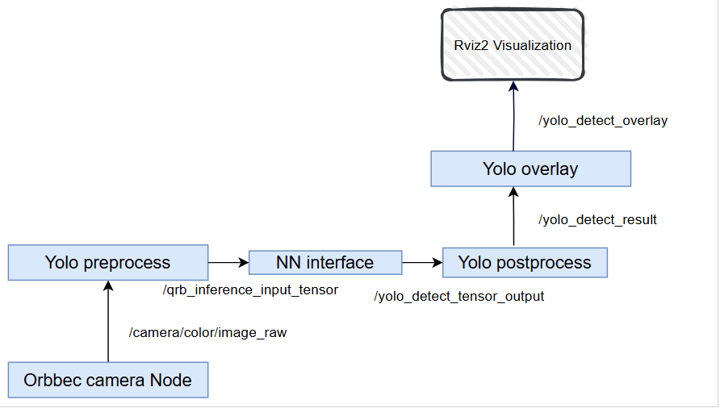

# AI Samples Object Detection	

## Overview

Ultralytics YOLOv8 is a machine learning model that predicts bounding boxes, segmentation masks and classes of objects in an image.

`sample_object_detction` is a Python-based launch file that uses QNN for model inference. 

For more information, please refer to  https://github.com/qualcomm-qrb-ros/qrb_ros_samples/tree/main/ai_vision/sample_object_detction)


## Pipeline flow for Object Detection



## ROS Nodes Used in Object Detection

| ROS Node                           | Description                                                  |
| ---------------------------------- | ------------------------------------------------------------ |
| `orbbec_camera `                   | The `orbbec-camera` sample application enables the Orbbec Gemini camera 335L to work in RGB or depth mode. This application generates the RGB and depth information by topics. |
| `yolo_preprocess_node `            | qrb_ros_yolo_processor provides ros nodes to execute pre/post-process for Yolo model. refer to [qualcomm-qrb-ros/qrb_ros_tensor_process: qrb_ros_yolo_processor provides ros nodes to execute pre/post-process for Yolo model](https://github.com/qualcomm-qrb-ros/qrb_ros_tensor_process) |
| `nn_inference_node `               | qrb_ros_nn_inference is a ROS2 package for performing neural network model, providing  AI-based perception for robotics applications. . refer to [qualcomm-qrb-ros/qrb_ros_nn_inference: qrb_ros_nn_inference is a ros2 package for performing neural network model, providing AI-based perception for robotics applications.](https://github.com/qualcomm-qrb-ros/qrb_ros_nn_inference) |
| `yolo_detection_postprocess_node ` | Same as above                                                |
| `yolo_detection_overlay_node `     | Same as above                                                |

## ROS Topics Used in Object Detection

| ROS Topic                      | Type                                          | Published By                       |
| ------------------------------ | --------------------------------------------- | ---------------------------------- |
| `/camera/color/image_raw `     | `< sensor_msgs.msg.Image> `                   | `orbbec_camera `                   |
| `/qrb_inference_input_tensor ` | `< qrb_ros_tensor_list_msgs/msg/TensorList> ` | `yolo_preprocess_node `            |
| `/yolo_detect_result `         | `<vision_msgs/msg/Detection2DArray> `         | `nn_inference_node `               |
| `/yolo_detect_tensor_output `  | `< qrb_ros_tensor_list_msgs/msg/TensorList> ` | `yolo_detection_postprocess_node ` |
| `/yolo_detect_overlay `        | `< sensor_msgs.msg.Image> `                   | `yolo_detection_overlay_node `     |

## Use Case on Ubuntu and QCLINUX

<details>
  <summary>Use Case on Ubuntu</summary>

#### Case: Out of box to run sample on ubuntu

Follow bellow steps on device

```
(ssh) wget https://raw.githubusercontent.com/qualcomm-qrb-ros/qrb_ros_samples/refs/heads/main/tools/qirp-setup.sh -O qirp-setup.sh
(ssh) source qirp-setup.sh


#run  samples
(ssh) ros2 launch sample_object_detction launch_with_orbbec_camera.py
```

</details>

<details>
  <summary> Use cases on QCLINUX</summary>   
#### Prerequisites

- `SSH` is enabled in 'Permissive' mode with the steps mentioned in [Log in using SSH](https://docs.qualcomm.com/bundle/publicresource/topics/80-70017-254/how_to.html?vproduct=1601111740013072&latest=true#use-ssh).

- Download Robotics image and QIRP SDK from [QC artifacts](https://artifacts.codelinaro.org/ui/native/qli-ci/flashable-binaries/qirpsdk/) or Generate Robotics image and QIRP SDK with [meta-qcom-robotics-sdk/README.md](https://github.com/qualcomm-linux/meta-qcom-robotics-sdk)

- The prebuilt robotics image is flashed, see [Flash image](https://docs.qualcomm.com/bundle/publicresource/topics/80-70017-254/flash_images.html?vproduct=1601111740013072&latest=true)

#### Case1: Out of box to run sample on QCLINUX

​	Follow bellow steps on device

```
#source qirp sdk env
(ssh) mount -o remount rw /usr
(ssh) source /usr/share/qirp-setup.sh -m

#run  samples
(ssh) ros2 launch sample_object_detction launch_with_orbbec_camera.py
```

</details>