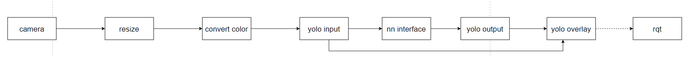

# AI Samples Object detection

The `object detection` sample enables a function that object detection case with qrb ros nodes.

It captures the image topic from the ROS system and publishes the result with the `/yolo_detect_overlay/compressed`.

This figure contains the basic messages and data transfer channels, with the relevant client/server and ROS node.

## Use cases on Ubuntu

### Prerequisites

- `SSH` is enabled in ‘Permissive’ mode with the steps mentioned in [Log in using SSH](https://docs.qualcomm.com/bundle/publicresource/topics/80-70017-254/how_to.html?state=preview#use-ssh).

- Download and run QIRP SDK environment setup scripts  from [qualcomm-linux/meta-qcom-robotics-sdk](https://github.com/qualcomm-linux/meta-qcom-robotics-sdk) 
  ```
  (ssh) wget https://raw.githubusercontent.com/qualcomm-linux/meta-qcom-robotics-sdk/refs/heads/kirkstone/recipes-sdk/files/qirp-setup.sh
  ```

### **Case 1: Run out-of-the-box Object detection** 

- On device,  run the following commands in a terminal to set up QIRP SDK and ROS2 environment.

  Value range of ROS_DOMAIN_ID: [0, 232]

```
(ssh)source qirp-setup.sh
(ssh)sudo -i ;
(ssh)source  /opt/ros/humble/setup.bash;source /home/ubuntu/qirp-sdk/install/setup.bash;export HOME=/home/ubuntu;export ROS_DOMAIN_ID=123; ros2 run image_transport republish raw in:=/yolo_detect_overlay compressed out/compressed:=/yolo_detect_overlay/compressed & ros2 launch sample_object_detection launch.py model:=/home/ubuntu/qirp-sdk/model/YOLOv8-Detection.tflite label_file:=/home/ubuntu/qirp-sdk/model/coco.yaml & ros2 run sample_object_detection image_converter_node
```

- on ubuntu computer, run the following commands in a terminal to set up QIRP SDK and ROS2 environment. run rqt to visualize object detection results.

  Value range of ROS_DOMAIN_ID: [0, 232]

```
Insrall ros as the link https://docs.ros.org/en/humble/Installation.html

(ssh) source /opt/ros/humble/setup.bash
(ssh) export ROS_DOMAIN_ID=123
(ssh) rqt
```

### **Case 2: Build and run Object detection** 

**Steps:**  

1. Download projects 

   	```
   #download dependency ros node projects
      	cd /home/ubuntu/qirp-sdk/src
      	git clone https://github.com/quic-qrb-ros/qrb_ros_camera.git
      	git clone https://github.com/quic-qrb-ros/qrb_ros_imu.git
      	git clone https://github.com/quic-qrb-ros/lib_mem_dmabuf.git
      	git clone https://github.com/quic-qrb-ros/qrb_ros_transport.git
      	git clone https://github.com/quic-qrb-ros/qrb_ros_system_monitor.git
      	git clone https://github.com/quic-qrb-ros/qrb_ros_yolo_processor.git 
      	git clone https://github.com/quic-qrb-ros/qrb_ros_interfaces.git 
	
   #git clone samples
      	git clone https://github.com/quic-qrb-ros/qrb_ros_samples.git
   
    #download ai model
      	wget https://huggingface.co/qualcomm/YOLOv8-Detection/resolve/main/YOLOv8-Detection.tflite?download=true -O /home/ubuntu/qirp-sdk/model/YOLOv8-Detection.tflite -O /home/ubuntu/qirp-sdk/model/YOLOv8-Detection.tflite
      	wget https://raw.githubusercontent.com/ultralytics/ultralytics/refs/heads/main/ultralytics/cfg/datasets/coco.yaml  -O /home/ubuntu/qirp-sdk/model/coco.yaml  -O /home/ubuntu/qirp-sdk/model/coco.yaml  
   ```
   
2.  build ros packages   	

   ```
   source /opt/ros/humble/setup.sh
   colcon build --executor sequential
   ```


3. Run ros projects

   Refer to Case1 "Run out-of-the-box Object detection steps"
## Pipeline flow for Object detection

|                           | Table : ROS nodes used in OCR-service pipeline               |
| ------------------------- | ------------------------------------------------------------ |
| ROS node                  | Description                                                  |
| `qrb_ros_camera `         | Send camera info to ros network                              |
| `image_converter_node `   | Gets camera image topic , resize and convert from nv12 to rgb format |
| `qrb_ros_yolo_processor ` | yolo model preprocess postprocess node                       |
| `qrb_ros_nn_inference `   | run model with qualcomm qnn interface                        |


|                                 | Table : ROS topics used in OCR-service pipeline |                        |
| ------------------------------- | ----------------------------------------------- | ---------------------- |
| ROS topic                       | Type                                            | Published by           |
| `/image`                        | `< sensor_msgs.msg.Image > `                    | qrb_ros_camera         |
| `/image_convert`                | `< sensor_msgs/msg/Image> `                     | image_converter_node   |
| `/yolo_raw_img `                | `< qrb_ros_tensor_list_msgs/msg/TensorList > `  | qrb_ros_yolo_processor |
| `/qrb_inference_output_tensor ` | `< qrb_ros_tensor_list_msgs/msg/TensorList > `  | qrb_ros_nn_inference   |
| `/yolo_detect_result `          | `< vision_msgs/msg/Detection2DArray > `         | qrb_ros_yolo_processor |
| `/yolo_detect_overlay `         | `< sensor_msgs.msg.Image > `                    | qrb_ros_yolo_processor |

