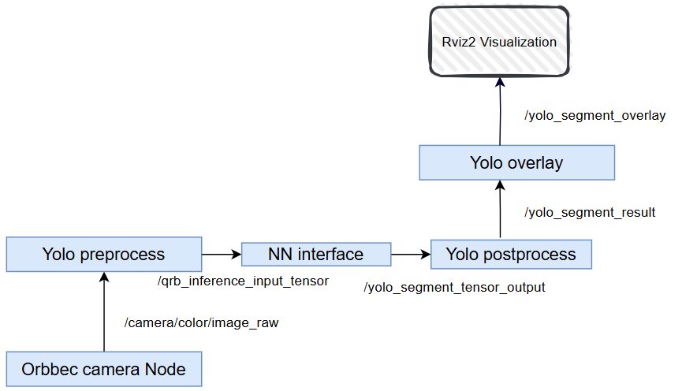

<div >
  <h1>AI Samples Object Segmentation</h1>
  <p align="center">
</div>


---

## 👋 Overview

The `sample_object_segmentation` is a Python launch file utilizing QNN for model inference. It demonstrates camera data streaming, AI-based inference, and real-time visualization of object segmentation results.”

Ultralytics YOLOv8 is a machine learning model that predicts bounding boxes, segmentation masks and classes of objects in an image.



| Node Name                                                    | Function                                                     |
| ------------------------------------------------------------ | ------------------------------------------------------------ |
| [qrb ros camera](https://github.com/qualcomm-qrb-ros/qrb_ros_camera) | Qualcomm ROS 2 package that captures images with parameters and publishes them to ROS topics. |
| [yolo preprocess](https://github.com/qualcomm-qrb-ros/qrb_ros_tensor_process) | Subscribes to image data, reshapes/resizes it, and republishes it to a downstream topic. |
| [qrb ros nn interface](https://github.com/qualcomm-qrb-ros/qrb_ros_nn_inference) | Loads a trained AI model, receives preprocessed images, performs inference, and publishes results. |
| [yolo postprocess](https://github.com/qualcomm-qrb-ros/qrb_ros_tensor_process) | Matches inference output with yolo label files               |
| [yolo overlay](https://github.com/qualcomm-qrb-ros/qrb_ros_tensor_process) | Subscribes yolo postprocess and image data, show the object detect results with ros topic |

## 🔎 Table of contents

  * [Used ROS Topics](#-used-ros-topics)
  * [Supported targets](#-supported-targets)
  * [Installation](#-installation)
  * [Usage](#-usage)
  * [Build from source](#-build-from-source)
  * [Contributing](#-contributing)
  * [Contributors](#%EF%B8%8F-contributors)
  * [FAQs](#-faqs)
  * [License](#-license)

## ⚓ Used ROS Topics 

| ROS Topic                      | Type                                          | Published By                     |
| ------------------------------ | --------------------------------------------- | -------------------------------- |
| `/camera/color/image_raw `     | `< sensor_msgs.msg.Image> `                   | `orbbec_camera `                 |
| `/qrb_inference_input_tensor ` | `< qrb_ros_tensor_list_msgs/msg/TensorList> ` | `yolo_preprocess_node `          |
| `/yolo_segment_result `        | `<vision_msgs/msg/Detection2DArray> `         | `nn_inference_node `             |
| `/yolo_segment_tensor_output ` | `< qrb_ros_tensor_list_msgs/msg/TensorList> ` | `yolo_segment_postprocess_node ` |
| `/yolo_segment_overlay `       | `< sensor_msgs.msg.Image> `                   | `yolo_segment_overlay_node `     |

## 🎯 Supported targets

<table >
  <tr>
    <th>Development Hardware</th>
     <td>Qualcomm Dragonwing™ IQ-9075 EVK</td>
     <td>Qualcomm Dragonwing™ IQ-8275 EVK</td>
  </tr>
  <tr>
    <th>Hardware Overview</th>
    <th><a href="https://www.qualcomm.com/products/internet-of-things/industrial-processors/iq9-series/iq-9075"></a></th>
    <th>coming soon...</th>
  </tr>
  <tr>
    <th>GMSL Camera Support</th>
    <td>LI-VENUS-OX03F10-OAX40-GM2A-118H(YUV)</td>
    <td>LI-VENUS-OX03F10-OAX40-GM2A-118H(YUV)</td>
  </tr>
</table>


## ✨ Installation

> [!IMPORTANT]
> **PREREQUISITES**: The following steps need to be run on **Qualcomm Ubuntu** and **ROS Jazzy**.<br>
> Reference [Install Ubuntu on Qualcomm IoT Platforms](https://ubuntu.com/download/qualcomm-iot) and [Install ROS Jazzy](https://docs.ros.org/en/jazzy/index.html) to setup environment. <br>
> For Qualcomm Linux, please check out the [Qualcomm Intelligent Robotics Product SDK](https://docs.qualcomm.com/bundle/publicresource/topics/80-70018-265/introduction_1.html?vproduct=1601111740013072&version=1.4&facet=Qualcomm%20Intelligent%20Robotics%20Product%20(QIRP)%20SDK) documents.

Add Qualcomm IOT PPA for Ubuntu:

```
sudo add-apt-repository ppa:ubuntu-qcom-iot/qcom-ppa
sudo add-apt-repository ppa:ubuntu-qcom-iot/qirp
sudo apt update
```


Install Debian package:

```
sudo apt install ros-jazzy-sample-object-segmentation
```

## 🚀 Usage

<details>
  <summary>Usage details</summary>


**On Host**

Reference the [qrb_ros_tensor_process](https://github.com/qualcomm-qrb-ros/qrb_ros_tensor_process) README to build and download the yolo model

```
#when download yolo model , please using qnn_context_binary and device like bellow 

#for IQ-8275  
python3 -m qai_hub_models.models.yolov8_seg.export --target-runtime tflite  --device "QCS8275 (Proxy)"

#for IQ-9075
python3 -m qai_hub_models.models.yolov8_seg.export --target-runtime tflite  --device "QCS9075 (Proxy)"
```

Find label file like bellow commands

```
$sudo find / -name coco8.yaml
/home/ubuntu/venv_qaihub/lib/python3.12/site-packages/ultralytics/cfg/datasets/coco8.yaml
/home/ubuntu/.qaihm/models/yolov8_det/v1/ultralytics_ultralytics_git/ultralytics/cfg/datasets/coco8.yaml
```

**On Device**

Run the sample env on device


```bash
#Prepare above model and move to default model path
mkdir /opt/model/
mv yolov8_seg.tflite /opt/model/

mv coco.ymal /opt/

source /opt/ros/jazzy/setup.bash

ros2 launch sample_object_segmentation launch_with_qrb_ros_camera.py model:=/opt/model/yolov8_seg.tflite
```

The output for these commands:

```
ubuntu@ubuntu:/opt$ ros2 launch sample_object_segmentation launch_with_qrb_ros_camera.py model:=/opt/model/yolov8_seg_qcs9075.tflite
[INFO] [launch]: All log files can be found below /home/ubuntu/.ros/log/2025-11-13-07-35-16-363743-ubuntu-20397
[INFO] [launch]: Default logging verbosity is set to INFO
[INFO] [component_container-1]: process started with pid [20421]
[component_container-1] [INFO] [1763019316.919533631] [yolo_node_container]: Load Library: /opt/ros/jazzy/lib/libcamera_node.so
[component_container-1] [INFO] [1763019316.926755417] [yolo_node_container]: Found class: rclcpp_components::NodeFactoryTemplate<qrb_ros::camera::CameraNode>
[component_container-1] [INFO] [1763019316.926889583] [yolo_node_container]: Instantiate class: rclcpp_components::NodeFactoryTemplate<qrb_ros::camera::CameraNode>
[component_container-1] [INFO] [1763019316.939036085] [camera_node]: QRB Camera Node start
[component_container-1] [INFO] [1763019316.939321240] [camera_node]: load camera intrinsic param
[component_container-1] [INFO] [1763019316.945852352] [camera_node]: system time: 193851405061215 ros time: 1763019316945847769 time offset: 1762825465540786554 ns
[component_container-1] [INFO] [1763019316.946430735] [camera_node]: QRB Camera Node init success
[component_container-1] [INFO] [QMMFCamera]: start camera.
[component_container-1] [INFO] [CameraManager]: start camera success!!
[component_container-1] [INFO] [CameraManager]: create qmmf listener!!
[INFO] [launch_ros.actions.load_composable_nodes]: Loaded node '/camera_node' in container '/yolo_node_container'
[component_container-1] [INFO] [1763019317.005720333] [yolo_node_container]: Load Library: /opt/ros/jazzy/lib/libqrb_ros_yolo_process_component.so
[component_container-1] [INFO] [1763019317.081992086] [yolo_node_container]: Found class: rclcpp_components::NodeFactoryTemplate<qrb_ros::yolo_process::YoloDetOverlayNode>
[component_container-1] [INFO] [1763019317.082070940] [yolo_node_container]: Found class: rclcpp_components::NodeFactoryTemplate<qrb_ros::yolo_process::YoloDetPostProcessNode>
[component_container-1] [INFO] [1763019317.082080731] [yolo_node_container]: Found class: rclcpp_components::NodeFactoryTemplate<qrb_ros::yolo_process::YoloSegOverlayNode>
[component_container-1] [INFO] [1763019317.082088023] [yolo_node_container]: Instantiate class: rclcpp_components::NodeFactoryTemplate<qrb_ros::yolo_process::YoloSegOverlayNode>
[component_container-1] [INFO] [1763019317.093561194] [yolo_segment_overlay_node]: YoloSegOverlayNode: mask_res: 160x160, resize_res: 640x640
[INFO] [launch_ros.actions.load_composable_nodes]: Loaded node '/yolo_segment_overlay_node' in container '/yolo_node_container'
[component_container-1] [INFO] [1763019317.093615465] [yolo_segment_overlay_node]: init done~
[component_container-1] [INFO] [1763019317.096262118] [yolo_node_container]: Found class: rclcpp_components::NodeFactoryTemplate<qrb_ros::yolo_process::YoloDetOverlayNode>
[component_container-1] [INFO] [1763019317.096300608] [yolo_node_container]: Found class: rclcpp_components::NodeFactoryTemplate<qrb_ros::yolo_process::YoloDetPostProcessNode>
[component_container-1] [INFO] [1763019317.096310972] [yolo_node_container]: Found class: rclcpp_components::NodeFactoryTemplate<qrb_ros::yolo_process::YoloSegOverlayNode>
[component_container-1] [INFO] [1763019317.096318420] [yolo_node_container]: Found class: rclcpp_components::NodeFactoryTemplate<qrb_ros::yolo_process::YoloSegPostProcessNode>
[component_container-1] [INFO] [1763019317.096325347] [yolo_node_container]: Instantiate class: rclcpp_components::NodeFactoryTemplate<qrb_ros::yolo_process::YoloSegPostProcessNode>
[component_container-1] [INFO] [1763019317.103333177] [yolo_segment_postprocess_node]: label file path: /opt/coco8.yaml
[component_container-1] [INFO] [1763019317.103391666] [yolo_segment_postprocess_node]: iou_thres: 0.500000
[component_container-1] [INFO] [1763019317.103408645] [yolo_segment_postprocess_node]: score_thres: 0.700000
[component_container-1] YAML Exception: bad file: /opt/coco8.yaml
[INFO] [launch_ros.actions.load_composable_nodes]: Loaded node '/yolo_segment_postprocess_node' in container '/yolo_node_container'
[component_container-1] [INFO] [1763019317.105448791] [yolo_segment_postprocess_node]: init done~
[component_container-1] [INFO] [1763019317.107817738] [yolo_node_container]: Load Library: /opt/ros/jazzy/lib/libqrb_ros_inference_node.so
[component_container-1] [INFO] [1763019317.110144080] [yolo_node_container]: Found class: rclcpp_components::NodeFactoryTemplate<qrb_ros::nn_inference::QrbRosInferenceNode>
[component_container-1] [INFO] [1763019317.110200538] [yolo_node_container]: Instantiate class: rclcpp_components::NodeFactoryTemplate<qrb_ros::nn_inference::QrbRosInferenceNode>
[component_container-1] INFO: Initialized TensorFlow Lite runtime.
[component_container-1] INFO: Applying 1 TensorFlow Lite delegate(s) lazily.
[component_container-1] INFO: Created TensorFlow Lite XNNPACK delegate for CPU.
[component_container-1] VERBOSE: Replacing 328 out of 336 node(s) with delegate (TfLiteXNNPackDelegate) node, yielding 7 partitions for the whole graph.
[component_container-1] INFO: Successfully applied the default TensorFlow Lite delegate indexed at 0.
[component_container-1]  *NOTE*: because a delegate has been applied, the precision of computations should be unchanged, but the exact output tensor values may have changed. If such output values are checked in your code, like in your tests etc., please consider increasing error tolerance for the check.
[component_container-1] [QRB INFO] Inference init Successfully!
[component_container-1] [INFO] [1763019317.157581394] [nn_inference_node]: Inference init successfully!


```

Then you can check ROS topics with the name`/yolo_segment_overlay` in  rviz2

</details>

## 👨‍💻 Build from source

<details>
  <summary>Build from source details</summary>
Install dependencies

```
sudo apt install ros-jazzy-rclpy \
  ros-jazzy-sensor-msgs \
  ros-jazzy-std-msgs \
  ros-jazzy-cv-bridge \
  ros-jazzy-ament-index-python \
  ros-jazzy-qrb-ros-tensor-list-msgs \
  python3-opencv \
  python3-numpy \
  ros-jazzy-image-publisher \
  ros-jazzy-qrb-ros-nn-inference \
  ros-jazzy-qrb-ros-camera \
```

Download the source code and build with colcon

```bash
source /opt/ros/jazzy/setup.bash
git clone https://github.com/qualcomm-qrb-ros/qrb_ros_samples.git
cd qrb_ros_samples/ai_vision/sample_sample_segmentation
colcon build
```

</details>

## 🤝 Contributing

We love community contributions! Get started by reading our [CONTRIBUTING.md](CONTRIBUTING.md).<br>
Feel free to create an issue for bug report, feature requests or any discussion💡.

## ❤️ Contributors

Thanks to all our contributors who have helped make this project better!

<table>
  <tr>
    <td align="center"><a href="https://github.com/quic-fulan"><br /><sub><b>quic-fulan</b></sub></a></td>
  </tr>
</table>


## ❔ FAQs

<details>
<summary>NA</summary><br>
</details>


## 📜 License

Project is licensed under the [BSD-3-Clause](https://spdx.org/licenses/BSD-3-Clause.html) License. 
