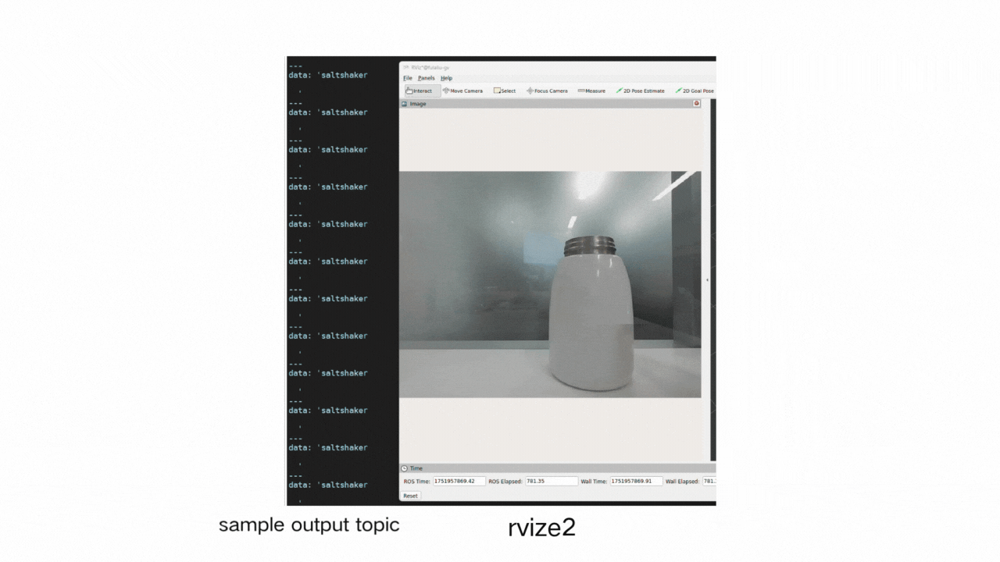
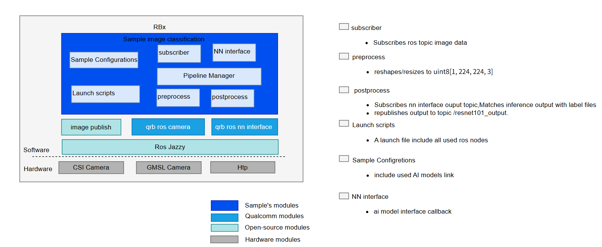

# AI Samples Resnet101

## Overview

ResNet101 is a machine learning model that can classify images from the Imagenet dataset. It can also be used as a backbone in building more complex models for specific use cases.

`sample_resnet101 quantized` is a Python-based classify images ROS node that uses QNN for model inference. 

For more information, please refer to  https://github.com/qualcomm-qrb-ros/qrb_ros_samples/tree/main/ai_vision/sample_resnet101_quantized)



## Supported Platforms

| Hardware                 | Software                       |
| ------------------------ | ------------------------------ |
| IQ-9075 Evaluation Kit   | QCLINUX;Canonical Ubuntu Image |
| RB3 Gen2 Vision Kit      | QCLINUX;Canonical Ubuntu Image |
| IQ-8 Beta Evaluation Kit | QCLINUX;Canonical Ubuntu Image |

## Pipeline flow for Resnet101 Quantized



## ROS Nodes Used in Resnet101 Quantized

| ROS Node                | Description                                                  |
| ----------------------- | ------------------------------------------------------------ |
| `qrb_ros_resnet101 `    | qrb_ros_resnet101 is a python-based ros jazzy packages realize classify images,  uses QNN htp as model backend. receive image topic , publish classify result topic. |
| `image_publisher_node ` | image_publisher is  a ros jazzy packages, can publish image ros topic with local path. source link:[ros-perception/image_pipeline: An image processing pipeline for ROS.](https://github.com/ros-perception/image_pipeline) |

## ROS Topics Used in Resnet101 Quantized

| ROS Topic                      | Type                         | Published By            |
| ------------------------------ | ---------------------------- | ----------------------- |
| `resnet101_quantized_results ` | `< sensor_msgs.msg.String> ` | `qrb_ros_resnet101`     |
| `image_raw `                   | `< sensor_msgs.msg.Image> `  | `image_publisher_node ` |

## Use Case on Ubuntu and QCLINUX

<details>
  <summary>Use Case on Ubuntu</summary>

#### Case: Out of box to run sample on ubuntu

Follow bellow steps on device

```
(ssh) wget https://raw.githubusercontent.com/qualcomm-qrb-ros/qrb_ros_samples/refs/heads/main/tools/qirp-setup.sh -O qirp-setup.sh
(ssh) source qirp-setup.sh
(ssh) chmod 777 /opt/ros/jazzy/share/sample_resnet101_quantized/


#run  samples
(ssh) ros2 launch sample_resnet101_quantized  launch_with_image_publisher.py
 or
(ssh) ros2 launch sample_resnet101_quantized  launch_with_image_publisher.py image_path:=/usr/share/sample_resnet101_quantized/cup.jpg
```

</details>

<details>
  <summary> Use cases on QCLINUX</summary>   


#### Prerequisites

- `SSH` is enabled in 'Permissive' mode with the steps mentioned in [Log in using SSH](https://docs.qualcomm.com/bundle/publicresource/topics/80-70017-254/how_to.html?vproduct=1601111740013072&latest=true#use-ssh).

- Download Robotics image and QIRP SDK from [QC artifacts](https://artifacts.codelinaro.org/ui/native/qli-ci/flashable-binaries/qirpsdk/) or Generate Robotics image and QIRP SDK with [meta-qcom-robotics-sdk/README.md](https://github.com/qualcomm-linux/meta-qcom-robotics-sdk)

- The prebuilt robotics image is flashed, see [Flash image](https://docs.qualcomm.com/bundle/publicresource/topics/80-70017-254/flash_images.html?vproduct=1601111740013072&latest=true)

#### Case1: Out of box to run sample on QCLINUX

​	Follow bellow steps on device

```
#source qirp sdk env
(ssh) mount -o remount rw /usr
(ssh) source /usr/share/qirp-setup.sh -m

#run  samples
(ssh) ros2 launch sample_resnet101_quantized  launch_with_image_publisher.py
 or
(ssh) ros2 launch sample_resnet101_quantized  launch_with_image_publisher.py image_path:=/usr/share/sample_resnet101_quantized/cup.jpg
```

#### Case2: Build and run sample on QCLINUX

  **On Host**

  On the host machine, move to the artifacts directory and decompress the package using the `tar` command.

  **Step 1: Build sample project**

```bash
#source qirp sdk env
tar -zxf qirp-sdk_<qirp_version>.tar.gz
cd <qirp_decompressed_path>/qirp-sdk
source setup.sh 

#build Samples
cd <qirp_decompressed_path>/qirp-sdk/qirp-samples/ai_vision/sample_resnet101_quantized/
colcon build
```

**Step 2: Package and push sample to device**

```bash
# package and push ai models
cd <qirp_decompressed_workspace>/qirp-sdk/qirp-samples/ai_vision/sample_resnet101_quantized/
tar -czvf model.tar.gz model 
scp model.tar.gz root@[ip-addr]:/opt/

# package and push build result of sample
cd <qirp_decompressed_path>/qirp-sdk/qirp-samples/ai_vision/sample_resnet101_quantized/install/sample_resnet101_quantized
tar -czvf sample_resnet101_quantized.tar.gz lib share
scp sample_resnet101_quantized.tar.gz root@[ip-addr]:/opt/
```

**On Device**

Login to the device, please use the command `ssh root@[ip-addr]`

**Step 1: Install sample package and model package**

```bash
# Remount the /usr directory with read-write permissions
(ssh) mount -o remount rw /usr

# Install sample package and model package
(ssh) tar --no-same-owner -zxf /opt/sample_resnet101_quantized.tar.gz -C /usr/
(ssh) tar --no-same-owner -zxf /opt/model.tar.gz -C /opt/
```

**Step 2: Setup runtime environment**

```bash
(ssh)  source /usr/share/qirp-setup.sh
```

**Step 3: Run sample**

```bash
(ssh) ros2 launch sample_resnet101_quantized  launch_with_image_publisher.py
 or
(ssh) ros2 launch sample_resnet101_quantized  launch_with_image_publisher.py image_path:=/usr/share/sample_resnet101_quantized/cup.jpg
```

</details>