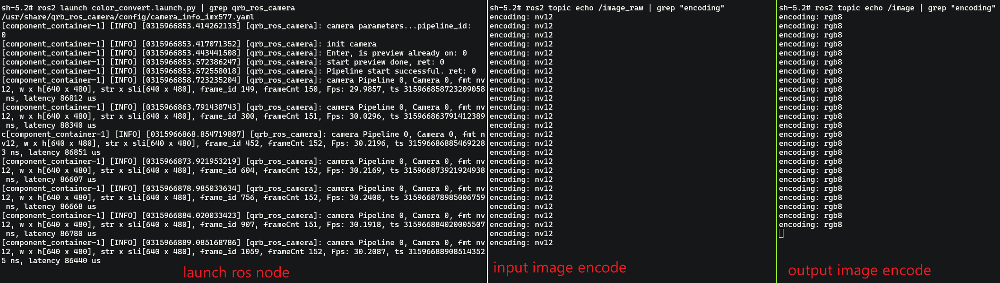

# QRB Color Space Conversion ROS Node

## Overview

Qualcomm's smart devices, such as the Dragonwing RB3 Gen 2, use NV12 as the default image color space conversion format. However, the more common color space format is RGB888. The `sample_colorspace_convert` application implements the following:
- Provides ROS nodes
	- API to convert NV12 to RGB888
	- API to convert RGB888 to NV12
- Supports `dmabuf` fd as input and output
- Input and output image receive and send with QRB ROS transport
- Hardware acceleration with GPU by OpenGL ES


## Pipeline flow for sample_colorspace_convert


## ROS Nodes Used in sample_colorspace_convert

| ROS Node                  | Description                                                                                |
| ------------------------- | ------------------------------------------------------------------------------------------ |
| `qrb_ros_camera`          | `qrb_ros_camera` is a ROS package to publish the camera data from camera sensor.           |
| `colorspace_convert_node` | `colorspace_convert_node` is a ROS package to convert color space between NV12 and RGB888. |
## ROS Topics Used in sample_colorspace_convert

|Names|Input/Output|Communicate Type|Message Type|Description|
|---|---|---|---|---|
|`/image_raw`|input|topic|`<qrb_ros::transport::type::Image>`|NV12/RGB8 image data|
|`/image`|output|topic|`<qrb_ros::transport::type::Image>`|NV12/RGB8 image data|

## Use cases on QCLINUX
### Prerequisites

- Please refer to [Settings](https://docs.qualcomm.com/bundle/publicresource/topics/80-70018-265/download-the-prebuilt-robotics-image_3_1.html?vproduct=1601111740013072&version=1.4&facet=Qualcomm%20Intelligent%20Robotics%20Product%20\(QIRP\)%20SDK) to complete the device and host setup.

### On host

**Step 1: Build sample project**
```shell
# set up qirp sdk environment
tar -zxf qirp-sdk_<qirp_version>.tar.gz
cd <qirp_decompressed_path>/qirp-sdk
rm ~/.bash_aliases
source setup.sh

# build sample
cd <qirp_decompressed_path>/qirp-samples/platform/sample_colorspace_convert
colcon build --merge-install --cmake-args ${CMAKE_ARGS}
```

**Step 2: Package and push sample to device**
```shell
cd <qirp_decompressed_path>/qirp-samples/platform/sample_colorspace_convert/install
tar -czvf sample_colorspace_convert.tar.gz lib share
scp sample_colorspace_convert.tar.gz root@ip-addr:/opt/

cd <qirp_decompressed_path>/qirp-samples/platform/sample_colorspace_convert
scp color_convert.launch.py root@ip-addr:/data/
```

### On device

To Login to the device, please use the command ssh root@[ip-addr]

**Step 1: Install sample package and model package**
```shell
# Remount the /usr directory with read-write permissions
(ssh) mount -o remount rw /usr

# Install sample package
(ssh) tar --no-same-owner -zxf /opt/sample_colorspace_convert.tar.gz -C /usr/
```

**Step 2: Setup runtime environment**
```shell
# Set HOME variable
(ssh) export HOME=/opt

# set SELinux to permissive mode
(ssh) setenforce 0

# setup runtime environment
(ssh) source /usr/share/qirp-setup.sh

# setup weston env
(ssh) export XDG_RUNTIME_DIR=/dev/socket/weston/
(ssh) mkdir -p $XDG_RUNTIME_DIR
(ssh) export WAYLAND_DISPLAY=wayland-1

# setup share memory
(ssh) export FASTRTPS_DEFAULT_PROFILES_FILE=/usr/share/qrb_ros_colorspace_convert/config/large_message_profile.xml
```

**Step 3: Run sample**
```shell
# Launch the pipeline python launch file
(ssh) cd /data/
(ssh) ros2 launch color_convert.launch.py | grep qrb_ros_camera
```

If success, you can see the logs as follows.
```shell
/usr/share/qrb_ros_camera/config/camera_info_imx577.yaml
component_container-1 INFO 0316153886.816795733 qrb_ros_camera: camera parameters...pipeline_id:   0
component_container-1 INFO 0316153886.819027556 qrb_ros_camera: init camera
component_container-1 INFO 0316153886.847274327 qrb_ros_camera: Enter, is preview already on: 0
component_container-1 INFO 0316153886.961631410 qrb_ros_camera: start preview done, ret: 0
component_container-1 INFO 0316153886.961695733 qrb_ros_camera: Pipeline start successful. ret: 0
component_container-1 INFO 0316153892.106624690 qrb_ros_camera: camera Pipeline 0, Camera 0, fmt nv12, w x h640 x 480, str x sli640 x 480, frame_id 149, frameCnt 150, Fps: 29.9519, ts 316153892106547398 ns, latency 86589 us
component_container-1 INFO 0316153897.140163385 qrb_ros_camera: camera Pipeline 0, Camera 0, fmt nv12, w x h640 x 480, str x sli640 x 480, frame_id 300, frameCnt 151, Fps: 30.1862, ts 316153897140137396 ns, latency 86950 us
```
The input image color space is NV12
```shell
(ssh) ros2 topic echo /image_raw | grep "encoding"
encoding: nv12
```
The output image color space is RGB888
```
(ssh) ros2 topic echo /image | grep "encoding"
encoding: rgb8
```