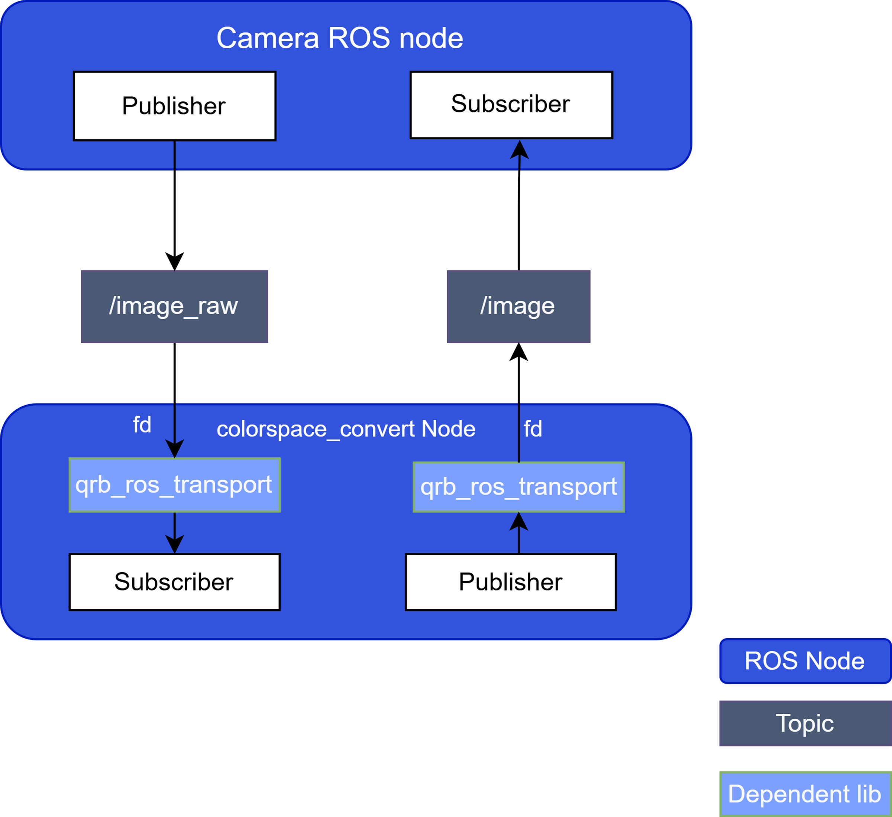

# QRB Color Space Conversion ROS Node

## Overview
The `qrb-ros-color-space-convert` sample application converts between NV12 and RGB888 formats. 

Qualcomm's smart devices, such as the Qualcomm Dragonwing™ RB3 Gen 2 development kits, use NV12 as the default image color space conversion format. However, the more common color space format is RGB888.

The `qrb-ros-color-space-convert` sample application implements the following:

- Provides ROS nodes
  - API to convert NV12 to RGB888
  - API to convert RGB888 to NV12
- Supports `dmabuf` fd as input and output
- Input and output image receive and send with QRB ROS transport
- Hardware acceleration with GPU by OpenGL ES

## Pipeline flow

The figure shows the pipeline for `qrb-ros-color-space-convert`:

 


## Supported Platforms 

| Hardware                   | Software                                 |
| -------------------------- | ---------------------------------------- |
| Qualcomm RB3 gen2          | LE.QCROBOTICS.1.0,Canonical Ubuntu Image |
| IQ-9075 Evaluation Kit     | LE.QCROBOTICS.1.0,Canonical Ubuntu Image |
| IQ-8 Beta   Evaluation Kit | LE.QCROBOTICS.1.0,Canonical Ubuntu Image |

## ROS Nodes Used in  QRB Color Space Conversion

| Node | Description |
|------|-------------|
| `customer_ros_node` | Publishes input image info to colorspace_convert_node |
| `colorspace_convert_node` | Converts color space between NV12 and RGB888 |

## ROS Topics QRB Color Space Conversion

| Topic | Direction | Type | Message Type | Description |
|-------|-----------|------|--------------|-------------|
| `/image_raw` | Input | Topic | `<qrb_ros::transport::type::Image>` | NV12/RGB8 input image data |
| `/image` | Output | Topic | `<qrb_ros::transport::type::Image>` | Converted NV12/RGB8 image data |

---

## Use Cases

### Prerequisites
- Device setup according to - [Settings](https://docs.qualcomm.com/bundle/publicresource/topics/80-70018-265/download-the-prebuilt-robotics-image_3_1.html?vproduct=1601111740013072&version=1.4&facet=Qualcomm%20Intelligent%20Robotics%20Product%20\(QIRP\)%20SDK)
- `customer_ros_node` ready
- Device connected to display monitor

---

### Case 1: Run Out-of-the-Box

```bash
# Set runtime environment
source /usr/share/qirp-setup.sh
export XDG_RUNTIME_DIR=/dev/socket/weston/
mkdir -p $XDG_RUNTIME_DIR
export WAYLAND_DISPLAY=wayland-1
export FASTRTPS_DEFAULT_PROFILES_FILE=/usr/share/qrb_ros_colorspace_convert/config/large_message_profile.xml

# NV12 to RGB888 conversion
ros2 launch qrb_ros_colorspace_convert colorspace_convert.launch.py 'conversion_type:=nv12_to_rgb8' 'latency_fps_test:=False'

# RGB888 to NV12 conversion
ros2 launch qrb_ros_colorspace_convert colorspace_convert.launch.py 'conversion_type:=rgb8_to_nv12' 'latency_fps_test:=False'

# Verify conversion
ros2 topic echo /image_raw | grep "encoding"
ros2 topic echo /image | grep "encoding"
```

### Case 2: Build and Run

#### Host Machine
```
# Set up QIR SDK environment
tar -zxf qirp-sdk_<qirp_version>.tar.gz
cd <qirp_decompressed_path>/qirp-sdk
rm ~/.bash_aliases
source setup.sh

# Build sample application
cd <qirp_decompressed_path>/qirp-samples/platform/sample_colorspace_convert
colcon build --merge-install --cmake-args ${CMAKE_ARGS}

# Package application
cd install
tar -czvf sample_colorspace_convert.tar.gz lib share
scp sample_colorspace_convert.tar.gz root@[ip-addr]:/opt/
```

#### Target Device
```
# SSH to device
ssh root@[ip-addr]

# Install package
mount -o remount rw /usr
tar --no-same-owner -zxf /opt/sample_colorspace_convert.tar.gz -C /usr/

# Set runtime environment
export HOME=/opt
setenforce 0
source /usr/share/qirp-setup.sh
export XDG_RUNTIME_DIR=/dev/socket/weston/
mkdir -p $XDG_RUNTIME_DIR
export WAYLAND_DISPLAY=wayland-1
export FASTRTPS_DEFAULT_PROFILES_FILE=/usr/share/qrb_ros_colorspace_convert/config/large_message_profile.xml

# Run application (refer to the Case 1 commands)
```