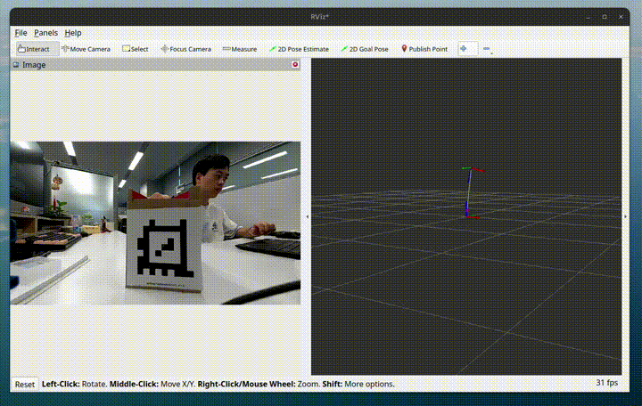

<div align="center">
  <h1>Apriltag Sample</h1>
  <p align="center">
    </img>
  </p>
  <p>ROS package for enabling AprilTag pipeline on Qualcomm robotics platforms</p>

  <a href="https://ubuntu.com/download/qualcomm-iot" target="_blank"></a>
  <a href="https://docs.ros.org/en/jazzy/" target="_blank"></a>

</div>

---

## 👋 Overview

The `sample_apriltag` is the ROS package to provide AprilTag pipeline samples for Qualcomm robotics platforms.

<div align="center">
  
</div>

<br>

- The pipeline accepts NV12 image from `qrb_ros_camera` and converts the color space to RGB8 format.
- Then it uses `image_proc` to rectify image, outputting `/image_rect`.
- The Apriltag node detects tags and calculates their pose, which is published via `/tf`.

## 🔎 Table of contents

- [👋 Overview](#-overview)
- [🔎 Table of contents](#-table-of-contents)
- [⚓ Used ROS Topics](#-used-ros-topics)
- [🎯 Supported targets](#-supported-targets)
- [✨ Installation](#-installation)
- [🚀 Usage](#-usage)
  - [Start the AprilTag pipeline sample](#start-the-apriltag-pipeline-sample)
  - [How to change camera id](#how-to-change-camera-id)
  - [How to change tag and configuration](#how-to-change-tag-and-configuration)
- [👨‍💻 Build from source](#-build-from-source)
  - [Dependencies](#dependencies)
- [🤝 Contributing](#-contributing)
- [❤️ Contributors](#️-contributors)
- [📜 License](#-license)

## ⚓ Used ROS Topics

| ROS Topic                       | Type                                          | Description                    |
| ------------------------------- | --------------------------------------------- | ------------------------------ |
| `/apriltag/image_nv12`   | `sensor_msgs/msg/Image` | NV12 image from QRB ROS Camera |
| `/apriltag/camera_info` | `sensor_msgs/msg/CameraInfo.msg` | camera metadata information |
| `/apriltag/image_rgb8` | `sensor_msgs/msg/Image` | RGB8 image output from color space conversion |
| `/apriltag/image_rect` | `sensor_msgs/msg/Image` | rectified RGB8 image from rectify node |
| `/apriltag/detections` | `apriltag_msgs/msg/AprilTagDetectionArray` | AprilTag detection results |
| `/tf` | `tf2_msgs/msg/TFMessage` | robot transform messages |

## 🎯 Supported targets

<table>
  <tr>
    <th>Development Hardware</th>
    <td>Qualcomm Dragonwing™ RB3 Gen2</td>
    <td>Qualcomm Dragonwing™ IQ-9075 EVK</td>
  </tr>
  <tr>
    <th>Hardware Overview</th>
    <th><a href="https://www.qualcomm.com/developer/hardware/rb3-gen-2-development-kit"></a></th>
    <th><a href="https://www.qualcomm.com/products/internet-of-things/industrial-processors/iq9-series/iq-9075"></a></th>
  </tr>
</table>


## ✨ Installation

> [!IMPORTANT]
> **PREREQUISITES**: The following steps need to be run on **Qualcomm Ubuntu** and **ROS Jazzy**.<br>
> Reference [Install Ubuntu on Qualcomm IoT Platforms](https://ubuntu.com/download/qualcomm-iot) and [Install ROS Jazzy](https://docs.ros.org/en/jazzy/index.html) to setup environment. <br>
> For Qualcomm Linux, please check out the [Qualcomm Intelligent Robotics Product SDK](https://docs.qualcomm.com/bundle/publicresource/topics/80-70018-265/introduction_1.html?vproduct=1601111740013072&version=1.4&facet=Qualcomm%20Intelligent%20Robotics%20Product%20(QIRP)%20SDK) documents.

Add Qualcomm IOT PPA for Ubuntu:

```bash
sudo add-apt-repository ppa:ubuntu-qcom-iot/qcom-ppa
sudo add-apt-repository ppa:ubuntu-qcom-iot/qirp
sudo apt update
```

Install Debian packages:

```bash
sudo apt install ros-jazzy-sample-apriltag
```

## 🚀 Usage

> [!Notice]
> The AprilTag pipeline is compatible exclusively with the Ubuntu server image.

### Start the AprilTag pipeline sample

```bash
sudo systemctl stop gdm.service
export XDG_RUNTIME_DIR=/run/user/1000
export WAYLAND_DISPLAY=wayland-1
sudo systemctl start weston-autostart.service

source /opt/ros/jazzy/setup.bash
ros2 launch sample_apriltag sample_apriltag.launch.py
```

These commands will start camera, color converter, rectify and apriltag node. 

```bash
ubuntu@ubuntu:~/ros2_ws$ ros2 topic list
/apriltag/camera_info
/apriltag/detections
/apriltag/image_nv12
/apriltag/image_rect
/apriltag/image_rect/zstd
/apriltag/image_rgb8
/parameter_events
/rosout
/tf
```

Put these tags at front of camera:

<table>
  <tr>
    <th align="center"></th>
    <th align="center"></th>
    <th align="center"></th>
  </tr>
  <tr>
    <td align="center">tagStandard41h12: 1</td>
    <td align="center">tagStandard41h12: 2</td>
    <td align="center">tagStandard41h12: 3</td>
  </tr>
</table>

The pipeline will output detection results with `/apriltag/detections` and detected tag pose with `/tf`.
We can check the topic output:

```bash
ubuntu@ubuntu:~/ros2_ws$ ros2 topic echo /apriltag/detections

header:
  stamp:
    sec: 1756288539
    nanosec: 411482784
  frame_id: stream1_2625
detections:
- family: tagStandard41h12
  id: 1
  hamming: 0
  goodness: 0.0
  decision_margin: 153.66729736328125
  centre:
    x: 595.2331201546427
    y: 382.94486450729545
```

We can see it detected tag: `tagStandard41h12` and the tag id is `1`.

### How to change camera id

Use `camera_id` launch parameter to set the id, such as `1`:

```bash
ros2 launch sample_apriltag sample_apriltag.launch.py camera_id:=1
```

### How to change tag and configuration

Select your Apriltag family and prepare the tag, you can download from: https://chaitanyantr.github.io/apriltag.html

Create a yaml config file, and set AprilTag parameters, such as tag family and tag size: 

```yaml
/**:
    ros__parameters:
        ...
        family: Standard41h12   # tag family name
        size: 0.092             # tag edge size in meter
        max_hamming: 12          # maximum allowed hamming distance (corrected bits)
```

Then set the config path in launch commands:

```bash
ros2 launch sample_apriltag sample_apriltag.launch.py apriltag_conf:=/path/to/your_config.yaml
```

## 👨‍💻 Build from source

### Dependencies

Install dependencies

```shell
sudo apt install ros-dev-tools \
  ros-jazzy-image-proc \
  ros-jazzy-apriltag-ros \
  ros-jazzy-qrb-ros-camera \
  ros-jazzy-qrb-ros-colorspace-convert
```

Download the source code and build with colcon

```bash
source /opt/ros/jazzy/setup.bash
git clone https://github.com/qualcomm-qrb-ros/qrb_ros_samples.git
colcon build --packages-up-to sample_apriltag
```

Run and debug

```bash
export XDG_RUNTIME_DIR=/run/user/1000
export WAYLAND_DISPLAY=wayland-1

source install/setup.bash
ros2 launch sample_apriltag sample_apriltag.launch.py
```

## 🤝 Contributing

We love community contributions! Get started by reading our [CONTRIBUTING.md](CONTRIBUTING.md).<br>
Feel free to create an issue for bug report, feature requests or any discussion💡.

## ❤️ Contributors

Thanks to all our contributors who have helped make this project better!

<table>
  <tr>
    <td align="center"><a href="https://github.com/penww"><br /><sub><b>penww</b></sub></a></td>
  </tr>
</table>

## 📜 License

Project is licensed under the [BSD-3-Clause-Clear](https://spdx.org/licenses/BSD-3-Clause-Clear.html) License. See [LICENSE](../../LICENSE) for the full license text.
