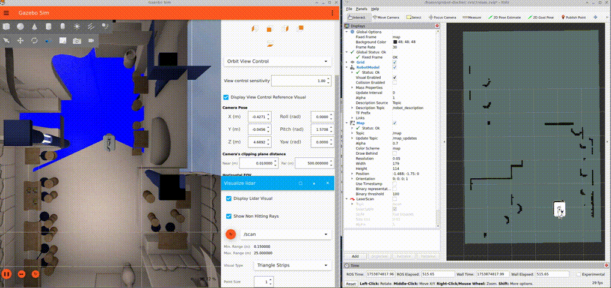

<div align="center">
  <h1>Simulation 2D Lidar SLAM</h1>
  <p align="center">
    
  </p>
  <p>Simulation 2D Lidar SLAM sample demonstrates how to run 2D lidar SLAM in a simulated environment, enabling simultaneous localization and mapping</p>
  
  <a href="https://ubuntu.com/download/qualcomm-iot" target="_blank"></a>
  <a href="https://docs.ros.org/en/jazzy/" target="_blank"></a>
  
</div>

---

## 👋 Overview

The [Simulation 2D Lidar SLAM](https://github.com/qualcomm-qrb-ros/qrb_ros_samples/tree/main/robotics/simulation_2d_lidar_slam) sample demonstrates how to run 2D lidar SLAM on Qualcomm robotics platform in a simulated environment, enabling simultaneous localization and mapping.

<div align="center">
  
</div>

<br>

## 🔎 Table of contents
  * [APIs](#-apis)
     * [ROS interfaces](#ROS-interfaces)
  * [Supported targets](#-supported-targets)
  * [Installation](#-installation)
  * [Usage](#-usage)
     * [Prerequisites](#-prerequisites)
     * [Start the ROS2 node](#-start-the-ROS2-node-on-device)
  * [Contributing](#-contributing)
  * [Contributors](#%EF%B8%8F-contributors)
  * [License](#-license)

## ⚓ APIs

### ROS interfaces

<table>
  <tr>
    <th>Name</th>
    <th>Type</th>
    <th>Description</th>
    <th>Published by</th>
  </tr>
  <tr>
    <td>/tracked_pose</td>
    <td>geometry_msgs.msg.PoseStamped</td>
    <td>The pose of the tracked frame with respect to the map frame</td>
    <td>Cartographer ROS node</td>
  </tr>
  <tr>
    <td>/scan_matched_points2</td>
    <td>sensor_msgs.msg.PointCloud2</td>
    <td>Point cloud as it was used for the purpose of scan-to-submap matching</td>
    <td>Cartographer ROS node</td>
  </tr>
  <tr>
    <td>/tf</td>
    <td>tf2_msgs.msg.TFMessage</td>
    <td>Spatial relationships between different coordinate frames</td>
    <td>Cartographer ROS node, qrb ros simulation</td>
  </tr>
  <tr>
    <td>/submap_list</td>
    <td>cartographer_ros_msgs.msg.SubmapList</td>
    <td>List of all submaps, including the pose and latest version number of each
  submap, across all trajectories</td>
    <td>Cartographer ROS node</td>
  </tr>
  <tr>
    <td>/map</td>
    <td>nav_msgs.msg.OccupancyGrid</td>
    <td>The 2D occupancy grid map of the environment</td>
    <td>Cartographer occupancy grid node</td>
  </tr>
  <tr>
    <td>/scan</td>
    <td>sensor_msg.msg.LaserScan</td>
    <td>2D laser scan data</td>
    <td>qrb ros simulation</td>
  </tr>
  <tr>
    <td>/odom</td>
    <td>nav2_msgs.msg.Odometry</td>
    <td>Robot’s estimated position and velocity over time</td>
    <td>qrb ros simulation</td>
  </tr>
</table>

## 🎯 Supported targets

<table >
  <tr>
    <th>Development Hardware</th>
    <td>Qualcomm Dragonwing™ RB3 Gen2</td>
    <td>Qualcomm Dragonwing™ IQ-9075 EVK</td>
    <td>Qualcomm Dragonwing™ IQ-8275 EVK</td>
  </tr>
  <tr>
    <th>Hardware Overview</th>
    <th><a href="https://www.qualcomm.com/developer/hardware/rb3-gen-2-development-kit"></a></th>
    <th><a href="https://www.qualcomm.com/products/internet-of-things/industrial-processors/iq9-series/iq-9075"></a></th>
    <th>Coming soon...</th>
  </tr>
</table>

---

## ✨ Installation

> [!IMPORTANT]
> **PREREQUISITES**: The following steps need to be run on **Qualcomm Ubuntu** and **ROS Jazzy**.<br>
> Reference [Install Ubuntu on Qualcomm IoT Platforms](https://ubuntu.com/download/qualcomm-iot) and [Install ROS Jazzy](https://docs.ros.org/en/jazzy/index.html) to setup environment. <br>
> For Qualcomm Linux, please check out the [Qualcomm Intelligent Robotics Product SDK](https://docs.qualcomm.com/bundle/publicresource/topics/80-70018-265/introduction_1.html?vproduct=1601111740013072&version=1.4&facet=Qualcomm%20Intelligent%20Robotics%20Product%20(QIRP)%20SDK) documents.

## 🚀 Usage

### 🔹 Prerequisites

#### Simulation environment setup on host

Please refer to the `Quick Start` of [QRB ROS Simulation](https://github.com/qualcomm-qrb-ros/qrb_ros_simulation) to `setup` the simulation development environment and `build` the `QRB ROS Simulation` project on your host machine. Ensure that the device and the host are on the same local network and can communicate with each other via ROS2.

#### Launch the `QRB Robot Base AMR` on host

```bash
ros2 launch qrb_ros_sim_gazebo gazebo_robot_base.launch.py world_model:=ionic
```

### 🔹 Start the ROS2 node on device

To Login to the device, please use the command `ssh root@[ip-addr]`

Prepare Device environment refer to [Qualcomm Intelligent Robotics (QIR) SDK User Guide](https://docs.qualcomm.com/bundle/publicresource/topics/80-70020-265/quick_start.html?state=releasecandidate#setup-demo-qs)

```bash
source /usr/share/qirp-setup.sh
ros2 launch cartographer_ros qrb_2d_lidar_slam_gazebo_sim.launch.py
```

The output for these commands:

```bash
[INFO] [launch]: All log files can be found below /opt/.ros/log/1980-01-06-03-53-48-803981-qcs6490-rb3gen2-vision-kit-4264
[INFO] [launch]: Default logging verbosity is set to INFO
[INFO] [cartographer_node-1]: process started with pid [4270]
[INFO] [cartographer_occupancy_grid_node-2]: process started with pid [4271]
[cartographer_node-1] [INFO] [0315978829.004265169] [cartographer logger]: I19800106 03:53:49.-2147483648  4270 node_main.cpp:36] Run Ignore Cycle
[cartographer_node-1] [INFO] [0315978829.012877148] [cartographer logger]: I19800106 03:53:49.-2147483648  4270 configuration_file_resolver.cc:41] Found '/usr/share/cartographer_ros/configuration_files/qrb_amr_mapping_2d.lua' for 'qrb_amr_mapping_2d.lua'.
[cartographer_node-1] [INFO] [0315978829.013167200] [cartographer logger]: I19800106 03:53:49.-2147483648  4270 configuration_file_resolver.cc:41] Found '/usr/share/cartographer/configuration_files/map_builder.lua' for 'map_builder.lua'.
```

---

## 🤝 Contributing

We love community contributions! Get started by reading our [CONTRIBUTING.md](CONTRIBUTING.md).<br>
Feel free to create an issue for bug report, feature requests or any discussion💡.

## ❤️ Contributors

Thanks to all our contributors who have helped make this project better!

<table>
  <tr>
    <td align="center"><a href="https://github.com/quic-weijshen"><br /><sub><b>quic-weijshen</b></sub></a></td>
    <td align="center"><a href="https://github.com/fulaliu"><br /><sub><b>fulaliu</b></sub></a></td>
  </tr>
</table>

## 📜 License

Project is licensed under the [BSD-3-Clause](https://spdx.org/licenses/BSD-3-Clause.html) License. See [LICENSE](./LICENSE) for the full license text.