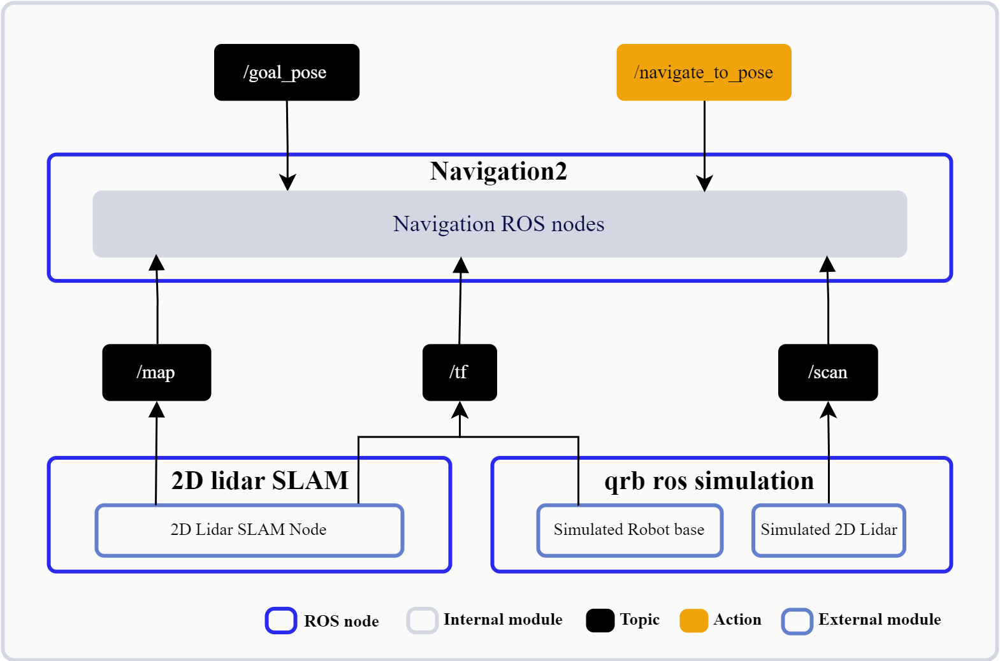

<div align="center">
  <h1>Simulation AMR Navigation</h1>
  <p align="center">
    
  </p>
  <p>Simulation AMR navigation sample demonstrates how to run navigation2 on Qualcomm robotics platform in a simulated environment</p>
  
  <a href="https://ubuntu.com/download/qualcomm-iot" target="_blank"></a>
  <a href="https://docs.ros.org/en/jazzy/" target="_blank"></a>
  
</div>

---

## 👋 Overview

The [Simulation AMR Navigation](https://github.com/qualcomm-qrb-ros/qrb_ros_samples/tree/main/robotics/simulation_amr_navigation) sample demonstrates how to run navigation2 on Qualcomm robotics platform in a simulated environment.

<div align="center">
  
</div>

<br>

## 🔎 Table of contents
  * [APIs](#-apis)
     * [ROS interfaces](#ROS-interfaces)
  * [Supported targets](#-supported-targets)
  * [Installation](#-installation)
  * [Usage](#-usage)
     * [Prerequisites](#-prerequisites)
     * [Start the ROS2 node](#-Start-2D-lidar-slam-on-device)
     * [Start navigation2 on device](#-Start-navigation2-on-device)
  * [Contributing](#-contributing)
  * [Contributors](#%EF%B8%8F-contributors)
  * [License](#-license)

## ⚓ APIs

### ROS interfaces

<table>
  <tr>
    <th>Name</th>
    <th>Type</th>
    <th>Description</th>
    <th>Published by</th>
  </tr>
  <tr>
    <td>/map</td>
    <td>nav_msgs.msg.OccupancyGrid</td>
    <td>The 2D occupancy grid map of the environment</td>
    <td>2D Lidar SLAM nodes</td>
  </tr>
  <tr>
    <td>/tf</td>
    <td>tf2_msgs.msg.TFMessage</td>
    <td>Spatial relationships between different coordinate frames</td>
    <td>2D Lidar SLAM nodes, qrb ros simulation</td>
  </tr>
  <tr>
    <td>/scan</td>
    <td>sensor_msg.msg.LaserScan</td>
    <td>2D laser scan data</td>
    <td>qrb ros simulation</td>
  </tr>
<tr>
  <td>/goal_pose</td>
  <td>geometry_msgs.msg.PoseStamped</td>
  <td>The target pose for navigation, including position and orientation in the map frame</td>
  <td>Application to call navigation2</td>
</tr>
<tr>
  <td>/navigate_to_pose</td>
  <td>nav2_msgs.action.NavigateToPose</td>
  <td>Action interface to request navigation to a specific pose</td>
  <td>Application to call navigation2</td>
</tr>
</table>

## 🎯 Supported targets

<table >
  <tr>
    <th>Development Hardware</th>
    <td>Qualcomm Dragonwing™ RB3 Gen2</td>
    <td>Qualcomm Dragonwing™ IQ-9075 EVK</td>
    <td>Qualcomm Dragonwing™ IQ-8275 EVK</td>
  </tr>
  <tr>
    <th>Hardware Overview</th>
    <th><a href="https://www.qualcomm.com/developer/hardware/rb3-gen-2-development-kit"></a></th>
    <th><a href="https://www.qualcomm.com/products/internet-of-things/industrial-processors/iq9-series/iq-9075"></a></th>
    <th>Coming soon...</th>
  </tr>
</table>

---

## ✨ Installation

> [!IMPORTANT]
> **PREREQUISITES**: The following steps need to be run on **Qualcomm Ubuntu** and **ROS Jazzy**.<br>
> Reference [Install Ubuntu on Qualcomm IoT Platforms](https://ubuntu.com/download/qualcomm-iot) and [Install ROS Jazzy](https://docs.ros.org/en/jazzy/index.html) to setup environment. <br>
> For Qualcomm Linux, please check out the [Qualcomm Intelligent Robotics Product SDK](https://docs.qualcomm.com/bundle/publicresource/topics/80-70018-265/introduction_1.html?vproduct=1601111740013072&version=1.4&facet=Qualcomm%20Intelligent%20Robotics%20Product%20(QIRP)%20SDK) documents.

## 🚀 Usage

### 🔹 Prerequisites

#### Install navigation2 on device

```bash
sudo apt install ros-jazzy-navigation2
sudo apt install ros-jazzy-nav2-bringup
```

#### Simulation environment setup on host

Please refer to the `Set up development environment` of [QRB ROS Simulation](https://github.com/qualcomm-qrb-ros/qrb_ros_simulation) to setup the simulation development environment and build the `QRB ROS Simulation` project on your host machine. Ensure that the device and the host are on the same local network and can communicate with each other via ROS2.

#### Launch the `QRB Robot Base AMR Mini` on host

```bash
ros2 launch qrb_ros_sim_gazebo gazebo_robot_base_mini.launch.py world_model:=ionic enable_odom_tf:=true
```

Press the `Play` button to start the simulation.

### 🔹 Download the source code from `qrb_ros_samples` repository on device

```bash
mkdir -p ~/qrb_ros_samples_ws/src && cd ~/qrb_ros_samples_ws/src
git clone https://github.com/qualcomm-qrb-ros/qrb_ros_samples.git
```

### 🔹 Start navigation2 on device

```bash
source /opt/ros/jazzy/setup.bash
cd ~/qrb_ros_samples_ws/src/qrb_ros_samples/robotics/simulation_amr_navigation
ros2 launch nav2_bringup bringup_launch.py use_sim_time:=true map:=resource/map/map_gz_ionic.yaml
```

The output for these commands:

```bash
[INFO] [launch]: Default logging verbosity is set to INFO
[INFO] [controller_server-1]: process started with pid [6132]
[INFO] [smoother_server-2]: process started with pid [6133]
[INFO] [planner_server-3]: process started with pid [6134]
[INFO] [behavior_server-4]: process started with pid [6135]
[INFO] [bt_navigator-5]: process started with pid [6136]
[INFO] [waypoint_follower-6]: process started with pid [6137]
...
```

---

## 🤝 Contributing

We love community contributions! Get started by reading our [CONTRIBUTING.md](CONTRIBUTING.md).<br>
Feel free to create an issue for bug report, feature requests or any discussion💡.

## ❤️ Contributors

Thanks to all our contributors who have helped make this project better!

<table>
  <tr>
    <td align="center"><a href="https://github.com/quic-weijshen"><br /><sub><b>quic-weijshen</b></sub></a></td>
    <td align="center"><a href="https://github.com/fulaliu"><br /><sub><b>fulaliu</b></sub></a></td>
  </tr>
</table>

## 📜 License

Project is licensed under the [BSD-3-Clause](https://spdx.org/licenses/BSD-3-Clause.html) License. See [LICENSE](./LICENSE) for the full license text.