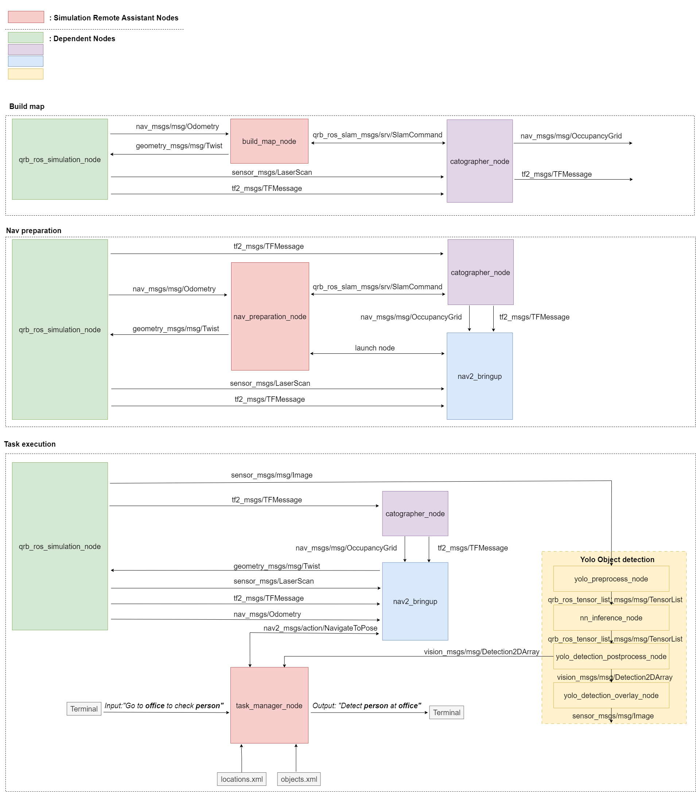

<div >
  <h1>Simulation Remote Assistant</h1>
  <p align="center">
</div>


---

## 👋 Overview

The `simulation_remote_assistant` sample application is the ROS package, which showcasing the capabilities of the Remote Assistant robot. It integrates multiple ROS 2 components to simulate an indoor autonomous mobile robot (AMR) workflow:

- Simulation: Based on [qrb_ros_simulation](https://github.com/qualcomm-qrb-ros/qrb_ros_simulation/tree/main) to simulate the robot in an office world.
- SLAM: Uses Cartographer for building maps of the environment.
- Navigation: Uses Nav2 for autonomous path planning and movement.
- Perception: Uses a YOLOv8 model for real-time object detection.

After building the map, users can interact with the robot by inputting natural language tasks such as "Go to office to check person". The robot will autonomously navigate to the specified location and perform object/person recognition tasks accordingly.

 

| Node Name                                                    | Function                                                     |
| ------------------------------------------------------------ | ------------------------------------------------------------ |
| [qrb_ros_simulation](https://github.com/qualcomm-qrb-ros/qrb_ros_simulation) | Set up the Qualcomm robotic simulation environment. |
| [nn_inference_node](https://github.com/qualcomm-qrb-ros/qrb_ros_nn_inference) | Loads a trained AI model, receives preprocessed images, performs inference, and publishes results. |
| [yolo_preprocess_node](https://github.com/qualcomm-qrb-ros/qrb_ros_tensor_process) | Execute pre/post-process for Yolo model. |
| [yolo_detection_postprocess_node](https://github.com/qualcomm-qrb-ros/qrb_ros_tensor_process) | Same as above. |
| [yolo_detection_overlay_node](https://github.com/qualcomm-qrb-ros/qrb_ros_tensor_process) | Same as above. |
| cartographer_node                                              | Processes sensor data to perform SLAM. |
| cartographer_occupancy_grid_node                              | Publishes a ROS occupancy grid map. |
| nav2_bringup                              | The Navigation2 stack for robot navigation. |
| build_map_node                             | Build the map of office world. |
| nav_preparation_node                             | Relocalization and launch the navigation node. |
| task_manager_node                             | Parse the input commands and execute the action. |

## 🔎 Table of contents

  * [Used ROS Topics](#-apis)
  * [Supported targets](#-supported-targets)
  * [Installation](#-installation)
  * [Usage](#-usage)
  * [Build from source](#-build-from-source)
  * [Contributing](#-contributing)
  * [Contributors](#%EF%B8%8F-contributors)
  * [FAQs](#-faqs)
  * [License](#-license)

## ⚓ Used ROS Topics 

| ROS Topic                       | Type                                          | Description                    |
| ------------------------------- | --------------------------------------------- | ------------------------------ |
| `/scan`                   | `<sensor_msgs/LaserScan>`                   | 2D lidar data for SLAM and mapping              |
| `/map `  | `<nav_msgs/OccupancyGrid>` | Occupancy grid map for navigation             |
| `/tf` | `<tf2_msgs/TFMessage>` | Transforms between coordinate frames |
| `/odom` | `<nav_msgs/Odometry>` | Odometry data for pose estimation |
| `/cmd_vel`| `<geometry_msgs/Twist>` | Velocity commands for robot movement |
| `/goal_pose` | `<geometry_msgs/PoseStamped>` | Target goal pose for navigation |
| `/camera/color/image_raw` | `<sensor_msgs.msg.Image>` | RGB image from simulation camera|
| `/qrb_inference_input_tensor` | `<qrb_ros_tensor_list_msgs/msg/TensorList>` | yolo_preprocess_node preprocess tensor|
| `/yolo_detect_result` | `<vision_msgs/msg/Detection2DArray>` | nn_inference_node publish the detected result|
| `/yolo_detect_tensor_output` | `<qrb_ros_tensor_list_msgs/msg/TensorLis>` | yolo_detection_postprocess_node postprocess tensor
| `/yolo_detect_overlay` | `<sensor_msgs.msg.Image>` | The detected result with bounding box


## 🎯 Supported targets

<table>
  <tr>
    <th>Development Hardware</th>
    <th>Hardware Overview</th>
  </tr>
  <tr>
    <td>Qualcomm Dragonwing™ IQ-9075 EVK</td>
    <td>
      <a href="https://www.qualcomm.com/products/internet-of-things/industrial-processors/iq9-series/iq-9075">
        
      </a>
    </td>
  </tr>
  <tr>
    <td>Qualcomm Robotics RB3 Gen2 Vision Kit</td>
    <td>
      <a href="https://www.qualcomm.com/products/robotics/robotics-rb3-platform">
        
      </a>
    </td>
  </tr>
  <tr>
    <td>Qualcomm Dragonwing™ IQ-8300</td>
    <td>
      <span>coming soon...</span>
    </td>
  </tr>
</table>


## ✨ Installation

> [!IMPORTANT]
> **PREREQUISITES**: The following steps need to be run on **Qualcomm Ubuntu** and **ROS Jazzy**.<br>
> Reference [Install Ubuntu on Qualcomm IoT Platforms](https://ubuntu.com/download/qualcomm-iot) and [Install ROS Jazzy](https://docs.ros.org/en/jazzy/index.html) to setup environment. <br>
> For Qualcomm Linux, please check out the [Qualcomm Intelligent Robotics Product SDK](https://docs.qualcomm.com/bundle/publicresource/topics/80-70018-265/introduction_1.html?vproduct=1601111740013072&version=1.4&facet=Qualcomm%20Intelligent%20Robotics%20Product%20(QIRP)%20SDK) documents.

Add Qualcomm IOT PPA for Ubuntu:

```bash
sudo add-apt-repository ppa:ubuntu-qcom-iot/qcom-noble-ppa
sudo add-apt-repository ppa:ubuntu-qcom-iot/qirp
sudo apt update
```

Install Debian package:

```bash
sudo apt install ros-jazzy-sample-remote-assistant
```

## 🚀 Usage

<details>
  <summary>Usage details</summary>

### Step1: Download the yolo object detection model

Reference the [qrb_ros_tensor_process](https://github.com/qualcomm-qrb-ros/qrb_ros_tensor_process) README to build and download the yolo model

```bash
#Prepare the model and move to default model path
mkdir /opt/model/
mv coco8.yaml yolov8_det_qcs9075.bin yolov8_det_qcs6490.tflite /opt/model/
```
### Step2: Run the simulation sample env on host

Reference the [qrb_ros_simulation](https://github.com/qualcomm-qrb-ros/qrb_ros_simulation/tree/main) README to prepare the simulation environment

```bash
ros2 launch qrb_ros_sim_gazebo gazebo_robot_base_mini.launch.py \
    world_model:=office \
    initial_x:=1.0 \
    initial_y:=6.0 \
    enable_depth_camera:=false
```
### Step3: Run the remote assistant sample on device

```bash
#Launch the map_nav_setup.launch.py scripts
ros2 launch simulation_remote_assistant map_nav_setup.launch.py

#Launch the yolo object detection script
ros2 launch simulation_remote_assistant yolo_detectcion.launch.py

#Run the task manager to parse the location and object
ros2 run simulation_remote_assistant task_manager_node

#Input the task commands in terminal
go to office to check person
```
</details>

## 👨‍💻 Build from source

<details>
  <summary>Build from source details</summary>

### Step1: Install dependencies

```bash
sudo apt install \
  ros-jazzy-rclpy \
  ros-jazzy-geometry-msgs \
  ros-jazzy-nav-msgs \
  ros-jazzy-vision-msgs \
  ros-jazzy-ament-index-python \
  ros-jazzy-qrb-ros-slam-msgs \
  python3-pyyaml \

```

### Step2: Download the source code and build with colcon

```bash
source /opt/ros/jazzy/setup.bash
git clone https://github.com/qualcomm-qrb-ros/qrb_ros_samples.git
cd robotics/simulation_remote_assistant
colcon build
source install/setup.bash
```

### Step3: Run and debug

Reference the usage details

</details>

## 🤝 Contributing

We love community contributions! Get started by reading our [CONTRIBUTING.md](CONTRIBUTING.md).<br>
Feel free to create an issue for bug report, feature requests or any discussion💡.

## ❤️ Contributors

Thanks to all our contributors who have helped make this project better!

<table>
  <tr>
    <td align="center">
      <a href="https://github.com/fxt-7">
        
        <br />
        <sub><b>xionfu</b></sub>
      </a>
    </td>
  </tr>
</table>


## ❔ FAQs

<details>
<summary>Which locations and objects are supported in task manager?</summary><br>
Location: office
Object: person
Sure, you could add new location and object in locaitons.yaml and objects.yaml
</details>


## 📜 License

Project is licensed under the [BSD-3-Clause](https://spdx.org/licenses/BSD-3-Clause.html) License. See [LICENSE](./LICENSE) for the full license text.