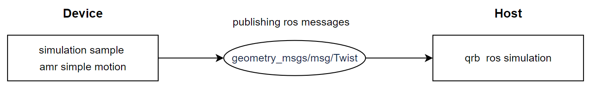

# Simulation Sample AMR Simple Motion

## Overview

The `AMR simple motion` sample is a Python-based ROS node used to control the simple movements of QRB AMRs within the simulator.

This sample allows you to control the movement of QRB AMRs via publishing the ROS messages to `/qrb_robot_base/cmd_vel` topic.

For more information, please refer to [qrb_ros_samples/robotics/simulation_sample_amr_simple_motion at jazzy · QUIC-QRB-ROS/qrb_ros_samples](https://github.qualcomm.com/QUIC-QRB-ROS/qrb_ros_samples/tree/jazzy/robotics/simulation_sample_amr_simple_motion)


## Pipeline flow for QRB AMR simple motion




## Supported Platforms 

| Hardware                   | Software                                 |
| -------------------------- | ---------------------------------------- |
| Qualcomm RB3 gen2          | LE.QCROBOTICS.1.0,Canonical Ubuntu Image |
| IQ-9075 Evaluation Kit     | LE.QCROBOTICS.1.0,Canonical Ubuntu Image |
| IQ-8 Beta   Evaluation Kit | LE.QCROBOTICS.1.0,Canonical Ubuntu Image |

## ROS Nodes Used in QRB AMR simple motion pipeline

|                               | Table : ROS nodes used in QRB AMR simple motion pipeline               |
| :---------------------------- | ------------------------------------------------------------ |
| ROS node                   | Description                                                  |
| `qrb_ros_simulation `             | qrb ros simulation is a ROS package designed to set up the Qualcomm robotic simulation environment. Source link: [QRB ROS Simulation](https://github.com/qualcomm-qrb-ros/qrb_ros_simulation) |

## ROS Topics Used in QRB AMR simple motion pipeline

|                                 | Table : ROS topics used in QRB AMR simple motion pipeline |                        |
| ------------------------------- | --------------------------------------------------- | ---------------------- |
| ROS topic                       | Type                                                | Published by           |
| `/qrb_robot_base/cmd_vel`       | `< geometry_msgs/msg/Twist >`            | simulation_sample_amr_simple_motion         |

## Use cases on QCLINUX

### Prerequisites

- Please refer to [Settings](https://docs.qualcomm.com/bundle/publicresource/topics/80-70018-265/download-the-prebuilt-robotics-image_3_1.html?vproduct=1601111740013072&version=1.4&facet=Qualcomm%20Intelligent%20Robotics%20Product%20(QIRP)%20SDK) to complete the device and host setup.

### Simulation Env Setup

- Please refer to the `Quick Start` of [QRB ROS Simulation](https://github.com/qualcomm-qrb-ros/qrb_ros_simulation) to launch `QRB Robot Base AMR` on host. Ensure that the device and the host are on the same local network and can communicate with each other via ROS communication.

### On Host

**Step 1: Build sample project**

On the host machine, move to the artifacts directory and decompress the package using the `tar` command.

```bash
# set up qirp sdk environment
tar -zxf qirp-sdk_<qirp_version>.tar.gz
cd <qirp_decompressed_path>/qirp-sdk
source setup.sh

# build sample
cd <qirp_decompressed_path>/qirp-sdk/qirp-samples/robotics/simulation_sample_amr_simple_motion
colcon build
```

**Step 2: Package and push sample to device**

```bash
# package and push build result of sample
cd <qirp_decompressed_path>/qirp-sdk/qirp-samples/robotics/simulation_sample_amr_simple_motion/install/simulation_sample_amr_simple_motion
tar -czf simulation_sample_amr_simple_motion.tar.gz lib share
scp simulation_sample_amr_simple_motion.tar.gz root@[ip-addr]:/opt/
```

### On Device

To Login to the device, please use the command `ssh root@[ip-addr]`

**Step 1: Install sample package**

```bash
# Remount the /usr directory with read-write permissions
(ssh) mount -o remount rw /usr

# Install sample package
(ssh) tar --no-same-owner -zxf /opt/simulation_sample_amr_simple_motion.tar.gz -C /usr/
```

**Step 2: Setup runtime environment**

```bash
# setup runtime environment
(ssh) source /usr/share/qirp-setup.sh
```

**Step 3: Run sample**
```bash
# Launch the simulation sample amr simple motion node.
(ssh) ros2 run simulation_sample_amr_simple_motion simple_motion
```

If the ROS node is launched successfully, the log `=== AMR Simple Motion Control Usage: ===` will be shown.

Then, you can input the motion control commands and check the movement status of the QRB AMR within the simulator on host.