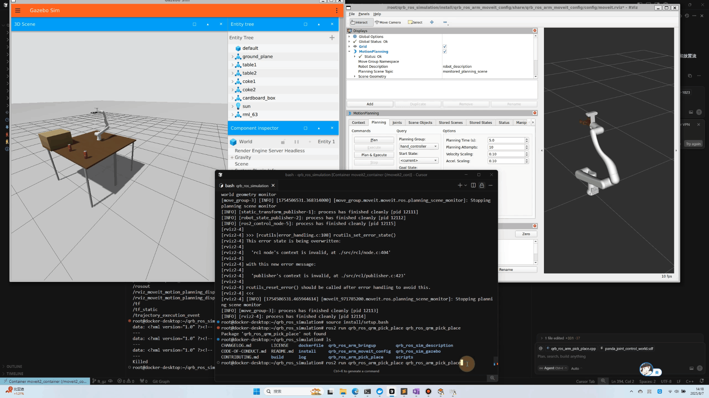

<div >
  <h1>Simulation Sample Pick and Place</h1>
  <p align="center">
</div>



---

## 👋 Overview

- The RML-63 Robotic Arm Pick and Place Demo is a C++-based ROS2 node that demonstrates autonomous pick-and-place operations using MoveIt2 for motion planning and Gazebo for physics simulation.


| Node Name                                                    | Function                                                     |
| ------------------------------------------------------------ | ------------------------------------------------------------ |
| qrb_ros_simulation | Sets up the Qualcomm robotic simulation environment. See [qrb_ros_simulation](https://github.com/qualcomm-qrb-ros/qrb_ros_simulation). |
| qrb_ros_arm_pick_and_place     | Defines pick and place positions with ROS2 launch.py configuration parameter support. |


## 🔎 Table of contents

- [👋 Overview](#-overview)
- [🔎 Table of contents](#-table-of-contents)
- [⚓ Used ROS Topics](#-used-ros-topics)
- [🎯 Supported targets](#-supported-targets)
- [✨ Installation](#-installation)
- [🚀 Usage](#-usage)
- [👨‍💻 Build from source](#-build-from-source)
- [🤝 Contributing](#-contributing)
- [❤️ Contributors](#️-contributors)
- [❔ FAQs](#-faqs)
- [📜 License](#-license)

## ⚓ Used ROS Topics 

| ROS Topic                       | Type                                          | Description                    |
| ------------------------------- | --------------------------------------------- | ------------------------------ |
| `/joint_states`                   | `<sensor_msgs/msg/JointState> `                   | 	Real-time joint position, velocity, and effort data for all robot joints              |
| `/hand_controller/controller_state` | `<control_msgs.msg.ControllerState>` |	Current state and status information of the gripper controller |
| `/hand_controller/joint_trajectory` |	`<trajectory_msgs.msg.JointTrajectory>` |	Trajectory commands sent to gripper joints for motion execution |
| `/rm_group_controller/controller_state` |	`<control_msgs.msg.ControllerState>` |	Current state and status information of the robotic arm controller |
| `/rm_group_controller/joint_trajectory` |	`<trajectory_msgs.msg.JointTrajectory>` |	Trajectory commands sent to arm joints for motion execution |
| `/robot_description` |	`<std_msgs.msg.String>` |	URDF robot description in XML format for robot modeling and visualization |
| `/robot_description_semantic` |	`<std_msgs.msg.String>` |	SRDF semantic robot description for MoveIt planning and configuration |

## 🎯 Supported targets

<table>
  <tr>
    <th>Development Hardware</th>
    <th>Hardware Overview</th>
  </tr>
  <tr>
    <td>Qualcomm Dragonwing™ IQ-9075 EVK</td>
    <td>
      <a href="https://www.qualcomm.com/products/internet-of-things/industrial-processors/iq9-series/iq-9075">
        
      </a>
    </td>
  </tr>
  <tr>
    <td>Qualcomm Dragonwing™ RB3 Gen2</td>
    <td>
      <a href="https://www.qualcomm.com/products/internet-of-things/industrial-processors/rb3-series/rb3-gen2">
        
      </a>
    </td>
  </tr>
    <tr>
    <td>Qualcomm Dragonwing™ IQ-8275</td>
    <td>
      <a href="https://www.qualcomm.com/products/internet-of-things/industrial-processors/iq8-series">View Product Details</a>
    </td>
  </tr>
</table>

## ✨ Installation

> [!IMPORTANT]
> The following steps need to be run on **Qualcomm Ubuntu** and **ROS Jazzy**.<br>
> Refer to [Install Ubuntu on Qualcomm IoT Platforms](https://ubuntu.com/download/qualcomm-iot) and [Install ROS Jazzy](https://docs.ros.org/en/jazzy/index.html) to setup environment. <br>
> For Qualcomm Linux, please check out the [Qualcomm Intelligent Robotics Product SDK](https://docs.qualcomm.com/bundle/publicresource/topics/80-70018-265/introduction_1.html?vproduct=1601111740013072&version=1.4&facet=Qualcomm%20Intelligent%20Robotics%20Product%20(QIRP)%20SDK) documents.

## 🚀 Usage

<details>
  <summary>Usage details</summary>

## 👨‍💻 Build from source

1. Prerequisites

- Install ros dependency:
```bash
sudo apt-get install -y qcom-adreno-dev
sudo apt install -y ros-jazzy-moveit
sudo apt install -y ros-dev-tools
sudo rosdep init
rosdep update
``` 

2. Launch Gazebo on HOST Docker

- Please refer to the Quick Start of [QRB ROS Simulation](https://github.com/qualcomm-qrb-ros/qrb_ros_simulation) to launch `QRB Robot ARM` on the host. Use the same local network and `ROS_DOMAIN_ID` to ensure devices can communicate via ROS.

- You can launch Gazebo with the following command:
```bash
source install/setup.bash
export ROS_DOMAIN_ID=55
ros2 launch qrb_ros_sim_gazebo gazebo_rml_63_gripper.launch.py world_model:=warehouse initial_x:=2.2 initial_y:=-2 initial_z:=1.025 initial_yaw:=3.14159 initial_pitch:=0.0 initial_roll:=0.0 use_sim_time:=true
```

- Click the `Play` button in Gazebo after the world environment renders, open another terminal, and use the following command to launch the controller:
```bash
source install/setup.bash
export ROS_DOMAIN_ID=55
ros2 launch qrb_ros_sim_gazebo gazebo_rml_63_gripper_load_controller.launch.py
``` 

- Ensure that after starting Gazebo in the host Docker, you can then run the pick and place node.

3. Download source code from the qrb-ros-sample repository:

```bash
mkdir -p ~/qrb_ros_sample_ws/src && cd ~/qrb_ros_sample_ws/src
git clone -b jazzy-rel https://github.com/qualcomm-qrb-ros/qrb_ros_samples.git
```

- Build the sample from source code:
```bash
cd ~/qrb_ros_sample_ws/src/qrb_ros_samples/robotics/simulation_sample_pick_and_place
rosdep install -i --from-path ./ --rosdistro jazzy -y
colcon build
source install/setup.bash
source /opt/ros/jazzy/setup.bash
```

4. Run the pick and place node

- You can launch the MoveIt2 configuration and demo launch file to start the arm motion:
```bash
export ROS_DOMAIN_ID=55
ros2 launch simulation_sample_pick_and_place simulation_sample_pick_and_place.launch.py
```

- If the ROS node is launched successfully, the log starting from `[move_group-1] You can start planning now!` appears. Open another terminal and use the following command to start the pick and place node:
```bash
source install/setup.bash
export ROS_DOMAIN_ID=55
ros2 run simulation_sample_pick_and_place qrb_ros_arm_pick_place
```

- You can then view the arm executing the pick and place operation in Gazebo.

</details>

## 🤝 Contributing

We love community contributions! Get started by reading our [CONTRIBUTING.md](CONTRIBUTING.md).<br>
Feel free to create an issue for bug report, feature requests or any discussion💡.

## ❤️ Contributors

Thanks to all our contributors who have helped make this project better!

<table>
  <tr>
    <td style="text-align: center;">
      <a href="https://github.com/DotaIsMind">
        
        <br />
        <sub><b>teng</b></sub>
      </a>
    </td>
  </tr>
</table>


## ❔ FAQs
How to move coke to origin pose?
You can execute command as below to move coke to origin pose:
```bash
gz service -s /world/warehouse/set_pose --reqtype gz.msgs.Pose --reptype gz.msgs.Boolean --timeout 1000 --req 'name: "coke1", position: { x: 3, y: -2.0, z: 1.02 }, orientation: { x: 0.0, y: 0.0, z: 0.0, w: 1.0 }'
```

## 📜 License

Project is licensed under the [BSD-3-Clause](https://spdx.org/licenses/BSD-3-Clause.html) License. See [LICENSE](../../LICENSE) for the full license text.