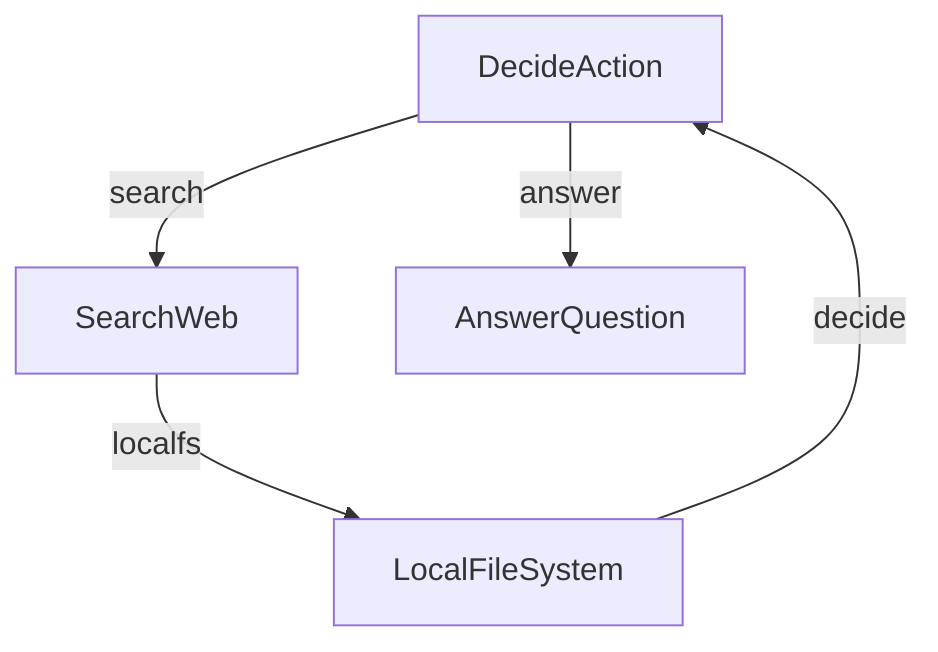

# Agent + Search + Local File System

This project demonstrates a simple yet powerful LLM-powered research agent. This implementation is based directly on the tutorial: [LLM Agents are simply Graph — Tutorial For Dummies](https://zacharyhuang.substack.com/p/llm-agent-internal-as-a-graph-tutorial).

Reference : https://github.com/The-Pocket/PocketFlow/tree/main/cookbook/pocketflow-agent

## Features

- Performs get and use tools via MCP format
- Makes decisions about when to use tools vs. when to answer
- Generates answers based on tool result
- **Save Results into local file system (current path)**

## Example Outputs


## Getting Started

1. Install the packages you need with this simple command:
```bash
pip install -r requirements.txt
```

2. Let's get your Tavily API key ready:

```bash
visit https://app.tavily.com/sign-in
get an API key
creating an account
```

3. Run agent with webui :

```bash
python qrb_webui_search_fsops.py
```

## How It Works?

The magic happens through a simple but powerful graph structure with three main parts:



Here's what each part does:
1. **DecideAction**: The brain that figures out whether to search or answer
2. **SearchWeb**: The researcher that goes out and finds information
3. **AnswerQuestion**: The writer that crafts the final answer
4. **LocalFileSystem**: The local filesystem to save search result

Here's what's in each file:
- [`qrb_webui_search_fsops.py`](./qrb_webui_search_fsops.py): The starting point - runs the whole show!
- [`test_yaml.py`](./test_yaml.py): this is the minimal test of yamle dictionary with your string