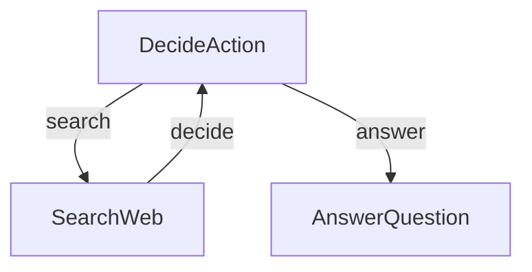

# Agent + Search + WEBUI

This project demonstrates a simple yet powerful LLM-powered research agent. This implementation is based directly on the tutorial: [LLM Agents are simply Graph — Tutorial For Dummies](https://zacharyhuang.substack.com/p/llm-agent-internal-as-a-graph-tutorial).

Reference : https://github.com/The-Pocket/PocketFlow/tree/main/cookbook/pocketflow-agent

## Features

- Performs get and use tools via MCP format
- Makes decisions about when to use tools vs. when to answer
- Generates answers based on tool result
- Used nicegui as simple UI

## Example Outputs


## Getting Started

0. Install redis in Windows
```bash
docker pull https://docker-registry.qualcomm.com/redis
docker run -d -p 6379:6379 redis

You can see in Windows docker GUI it is running
```

1. Install the packages you need with this simple command:
```bash
pip install -r requirements.txt
```

2. Let's get your Tavily API key ready:

```bash
visit https://app.tavily.com/sign-in
get an API key
creating an account
```

4. Run webui :

```bash
python nice.py
```

4. Run agent with webui :

```bash
python qrb_webui_search.py
```

## How It Works?

The magic happens through a simple but powerful graph structure with three main parts:



Here's what each part does:
1. **DecideAction**: The brain that figures out whether to search or answer
2. **SearchWeb**: The researcher that goes out and finds information
3. **AnswerQuestion**: The writer that crafts the final answer

Here's what's in each file:
- [`qrb_webui_search.py`](./qrb_webui_search.py): The starting point - runs the whole show!
- [`nice.py`](./nice.py): The minimal webUI you needed to see agent outputs